```{r setup, include=FALSE}
knitr::opts_chunk$set(
  echo = TRUE,
  message = FALSE,
  warning = FALSE
)

# Make tibble printing less restrictive in knitted output
options(
  tibble.width = Inf,   # show all columns
  tibble.print_max = 50, # max rows to print
  tibble.print_min = 50  # min rows to print
)
```

# Abstract

This project investigates the prediction of LendingClub interest rates using borrower and loan characteristics, with the goal of comparing models of increasing complexity and assessing their generalization performance. After extensive data preprocessing and exploratory analysis, three modeling approaches were evaluated: linear regression, Random Forest, and XGBoost. The linear model served as a transparent baseline but showed clear limitations due to non-linearity and heteroskedasticity. Tree-based ensemble methods substantially improved predictive accuracy by capturing complex interactions. The XGBoost achieved the strongest overall performance with a MSE of 8.78. Cross-validation and diagnostic analyses revealed stable generalization across data splits but also highlighted systematic underestimation of extreme interest rates, reflecting inherent challenges in modeling rare, high-risk loans. Overall, the results demonstrate that while advanced ensemble methods offer meaningful improvements over linear models, predictive accuracy is fundamentally constrained by data noise and heterogeneity in consumer credit markets.

# Data Preprocessing

In this exploratory data analysis we used following libraries:

```{r}
library(tidyverse)
library(corrplot)
library(fastDummies)
library(dplyr)
library(ggplot2)
library(patchwork)
library(lubridate)
library(caret)
library(readr)

```

The data is loaded into a dataframe and predefined columns are dropped. With a first look at the data using the data dictionary, as well as looking at the first few rows, a dictionary for the data types is created. The data is casted into the correct data types. and a copy of the original dataframe is created for backup.

```{r}
original <- read.csv("/Users/Jujou/Documents/Repos/GRP-6_DS-Project/DS-Project_data/LCdata.csv", 
                 row.names = NULL, 
                 sep = ";",
                 header = TRUE)

# Predefined columns to drop
columns_to_drop <- c("collection_recovery_fee",
                     "installment",
                     "funded_amnt",
                     "funded_amnt_inv",
                     "issue_d",
                     "last_pymnt_amnt",
                     "last_pymnt_d",
                     "loan_status",
                     "next_pymnt_d",
                     "out_prncp",
                     "out_prncp_inv",
                     "pymnt_plan",
                     "recoveries",
                     "total_pymnt",
                     "total_pymnt_inv",
                     "total_rec_int",
                     "total_rec_late_fee",
                     "initial_list_status",
                     "total_rec_prncp",
                     "url")

original_drop <- original[, -match(columns_to_drop,  names(original))]

# Dtype dictionary
dtype_dict <- list(
  acc_now_delinq = "integer",
  addr_state = "factor",
  all_util = "numeric",
  annual_inc = "numeric",
  annual_inc_joint = "numeric",
  application_type = "factor",
  collections_12_mths_ex_med = "integer",
  delinq_2yrs = "integer",
  desc = "factor",
  dti = "numeric",
  dti_joint = "numeric",
  earliest_cr_line = "str", # special case, will be converted to date later
  emp_length = "factor",
  emp_title = "factor",
  home_ownership = "factor",
  id = "integer",
  il_util = "numeric",
  inq_fi = "integer",
  inq_last_12m = "integer",
  inq_last_6mths = "integer",
  int_rate = "numeric",
  last_credit_pull_d = "str", # special case, will be converted to date later
  loan_amnt = "integer",
  max_bal_bc = "numeric",
  member_id = "integer",
  mths_since_last_delinq = "integer",
  mths_since_last_major_derog = "integer",
  mths_since_last_record = "integer",
  mths_since_rcnt_il = "integer",
  open_acc = "integer",
  open_acc_6m = "integer",
  open_il_12m = "integer",
  open_il_24m = "integer",
  open_il_6m = "integer",
  open_rv_12m = "integer",
  open_rv_24m = "integer",
  policy_code = "factor",
  pub_rec = "integer",
  purpose = "factor",
  revol_bal = "integer",
  revol_util = "numeric",
  term = "factor",
  title = "factor",
  tot_coll_amt = "numeric",
  tot_cur_bal = "numeric",
  total_acc = "integer",
  total_bal_il = "numeric",
  total_cu_tl = "integer",
  total_rev_hi_lim = "numeric",
  zip_code = "factor"
)

# Cast dtypes according to dictionary
for(col_name in names(dtype_dict)) {
  dtype <- dtype_dict[[col_name]]
  if(dtype == "factor") {
    original_drop[[col_name]] <- as.factor(original_drop[[col_name]])
  } else if(dtype == "integer") {
    original_drop[[col_name]] <- as.integer(original_drop[[col_name]])
  } else if(dtype == "numeric") {
    original_drop[[col_name]] <- as.numeric(original_drop[[col_name]])
  } else if(dtype == "date") {
    original_drop[[col_name]] <- as.Date(original_drop[[col_name]], format="%b-%Y")
  }
}

str(original_drop)

# Make Copy to work with

data <- original_drop
```

A predefined set of variables was excluded at the beginning of the preprocessing pipeline based on the project specification and the provided data dictionary. In addition, url is removed immediately after loading the raw data. Together wit id, and member_id these variables uniquely identify loans or borrowers but do not contain predictive information and are not available or meaningful for new loan applications. The id and member_id are dropped later after checking for duplicates. Dropping them at the outset prevents accidental use in downstream preprocessing or modeling steps and ensures that all subsequent transformations operate exclusively on potentially informative features.

## Data Understanding

### Dimensions

For a first understanding of the first few rows of the dataframe, we use the head() function. We check the dimensions of the dataframe using the dim() function, and we use the str() function to get an overview of the data types of each column. Furthermore we look at the summary statistics of the dataset. One could discuss whether one should look at the statistics before a train-test-split or after, since this leads to certain bias. In this case we decided to look at the statistics before the split, as learned in class.

```{r}
# Display the first few rows of the dataset
print("First few rows of the dataset:")
print(head(data))

# Get the dimensions of the dataset
dim(data)
print(paste("The number of rows is:", nrow(data))) # 798'641
print(paste("The number of columns is:", ncol(data))) # 52

# Get the structure of the dataset
str(data)
```

```{r}
# Summary statistics of the dataset
summary(data)
```

General observations: - Many numeric columns show very large ranges, some with maximum values far beyond plausible real-world limits. - Several variables contain placeholder values such as 999, 9999, or -1 indicating missing or unknown information. - A number of columns show repeated NA counts, such as NA's: 25 appearing across unrelated features, suggesting systematic missingness. - Some categorical columns include unusual entries like (Other) or long HTML-like strings.

Loan amount variables (loan_amnt, funded_amnt, funded_amnt_inv) show values ranging from \$500 to tens of millions, which is unrealistic for consumer lending and likely erroneous. Such extreme values need investigation and removal. Interest rate values are within expected ranges. Employment fields contain high-cardinality free-text entries and placeholders. Home ownership includes standard entries but also rare placeholders such as ANY or NONE. Annual income includes extreme values exceeding several million dollars, which are likely incorrect and should be capped or treated as NA. Zip codes and state entries contain unusual placeholders such as Other. Debt-to-income ratio includes 999 or 999.99 as clear placeholders and should be converted to NA. Delinquency-related variables contain many missing values and some extreme maxima that may be unrealistic. Revolving utilization contains impossible values greater than 100 percent, indicating data entry errors. Other credit variables show suspiciously high counts or balances that do not fit typical borrower profiles. Common placeholder patterns detected include 999, 999.0, 999.99, 9999, or textual placeholders like Other. These should be replaced with NA during cleaning. Repeated NA counts (e.g., NA's: 25) across certain variables suggest missing information originating from the same borrower rows. These relationships should be examined. Columns containing URLs or HTML-like descriptions contribute no analytical value and should be removed unless needed for text analysis. Issues to fix include extreme outliers, placeholder values requiring conversion to NA, text cleanup for free-text fields, consistent NA handling across affected rows, and parsing of date fields. Irrelevant columns such as url or verbose descriptions can be dropped. After cleaning, a new summary should be generated to confirm improvements.

```{r}
# vector of placeholder values to replace
placeholders <- c(999, 9999.00, 9999999)

data <- data %>%
  mutate(across(where(is.numeric),
                ~ ifelse(. %in% placeholders, NA, .)))
```

### Numerical and Categorical Data

To differentiate between numerical and categorical data, we can use the sapply() function to check the class of each column in the dataframe. Numerical columns are typically of class "integer" or "numeric", while categorical columns are of class "factor" or "character". We can then create separate lists for numerical and categorical columns.

```{r}
# Identify numerical and categorical columns
numerical_cols <- names(data)[sapply(data, function(col) is.numeric(col) ||
                                            is.integer(col))]
categorical_cols <- names(data)[sapply(data, function(col) is.factor(col) ||
                                              is.character(col))]
print("Numerical Columns:")
print(numerical_cols)
print("Categorical Columns:")
print(categorical_cols)
```

#### Categorical Data Analysis

Overview of the categorical columns

```{r}
categorical_cols <- names(data)[
  sapply(data, function(x) is.factor(x) || is.character(x))
]

categorical_cols
```

```{r}
num_categories <- sapply(
  data[categorical_cols],
  function(x) length(unique(na.omit(x)))
)

num_categories
```

```{r}
table(data$term)
```

```{r}
# Convert term to numeric loan duration in months
data$term <- trimws(as.character(data$term))   # remove whitespace and drop factor
data$term <- ifelse(grepl("^36", data$term), 36, 60)
data$term <- as.numeric(data$term)

str(data$term)
table(data$term)
```

Although the variable term has only two distinct values, it is represented as a numeric feature indicating the loan duration in months. This representation reflects the inherent quantitative nature of the variable, as the difference between a 36-month and a 60-month loan corresponds to a real and meaningful difference in exposure time and repayment horizon. Encoding term numerically preserves both the natural ordering and the magnitude of this difference, rather than merely distinguishing between categories. In addition, treating term as a numeric variable results in a more parsimonious model specification and allows us to avoid unnecessary categorical encoding.

Ordinal variables were encoded as ordered factors to preserve their ordinal structure without imposing unjustified metric assumptions. While some factor levels correspond to linear numeric scales, others do not. Therefore, a uniform numeric encoding would introduce inconsistent and potentially misleading distance assumptions. Although this encoding must be reapplied after exporting and reloading the preprocessed CSV file in the training and testing script (we recognized that ordering is not stored in the csv)

```{r}
table(data$emp_length)
```

```{r}
data$emp_length[data$emp_length == "n/a"] <- NA
data$emp_length <- factor(
  data$emp_length,
  levels = c(
    "< 1 year",
    "1 year",
    "2 years",
    "3 years",
    "4 years",
    "5 years",
    "6 years",
    "7 years",
    "8 years",
    "9 years",
    "10+ years"
  ),
  ordered = TRUE
)

table(data$emp_length)

```

The variable emp_length is treated as an ordered categorical feature representing the borrower’s employment tenure. Entries labeled as “n/a” are recoded as missing values, as they indicate the absence of reliable information rather than a valid employment duration. The remaining values are converted into an ordered factor with a logically increasing sequence from less than one year to ten or more years of employment. This encoding preserves the natural ordinal structure of employment tenure without imposing a strictly linear or continuous relationship, allowing the model to exploit relative ordering while avoiding unwarranted assumptions about the magnitude of differences between categories

```{r}
table(data$home_ownership)
```

```{r}
# all rows with ANY, NONE and OTHER are droped due to missing information about these columns and the low number of values.

data <- data %>%
  filter(!home_ownership %in% c("ANY", "NONE", "OTHER"))

# drop unused levels
data$home_ownership <- droplevels(data$home_ownership)

```

```{r}
# introduce order
data$home_ownership <- factor(
  data$home_ownership,
  levels = c("RENT", "MORTGAGE", "OWN"),
  ordered = TRUE
)
table(data$home_ownership)
```

The variable home_ownership is restricted to the categories RENT, MORTGAGE, and OWN, as the remaining categories (ANY, NONE, and OTHER) lack clear semantic interpretation in the context of borrower housing status and occur only infrequently in the dataset. Retaining these categories would introduce ambiguity and unnecessary noise without providing reliable predictive information. After removing the affected observations, unused factor levels are dropped, and the remaining categories are encoded as an ordered categorical variable reflecting increasing levels of housing stability.

```{r}
table(data$purpose)
```

```{r}
data$purpose <- factor(
  data$purpose,
  levels = c(
    "car",
    "credit_card",
    "debt_consolidation",
    "educational",
    "home_improvement",
    "house",
    "major_purchase",
    "medical",
    "moving",
    "other",
    "renewable_energy",
    "small_business",
    "vacation",
    "wedding"
  )
)
```

The variable purpose is treated as a nominal categorical feature representing the stated reason for the loan. All observed categories are explicitly defined as factor levels to enforce a consistent category schema and prevent unintended level ordering or implicit recoding during downstream processing. No ordinal relationship is assumed between categories, as loan purposes represent qualitatively different use cases rather than a ranked scale.

```{r}
knitr::kable(
  as.data.frame(table(data$purpose)),
  col.names = c("Purpose", "Count"),
  caption = "Distribution of loan purpose"
)
```

```{r}
# drop row for educational purpose so we can collapse one level
data <- data[data$purpose != "educational", ]
data$purpose <- droplevels(data$purpose)
```

The loan purpose category educational is excluded from further analysis due to its extreme rarity in the dataset after preprocessing. After preprocessing, only a single observation is associated with this category, making it statistically uninformative and unsuitable for reliable model estimation. Retaining such an isolated category would introduce unnecessary noise, increase model complexity, and risk unstable parameter estimates without providing meaningful predictive value. Given the negligible sample size and the absence of generalizable patterns, dropping this category improves model robustness and aligns with the principle of Occam’s razor by favoring a simpler and more reliable feature representation.

```{r eval = FALSE}
table(data$addr_state)
```

The variable addr_state is excluded from the dataset due to its high cardinality and extreme imbalance across the different categories. While the feature contains geographic information, several states are represented by only a handful of observations (IA with 2 records and ID with 3 records), where others dominate the dataset (CA, NY, TX). This imbalance leads to sparse and unstable category representations, increases model complexity through a large number of dummy variables, and raises the risk of overfitting without guaranteeing meaningful performance gains. Dropping this feature therefore improves model stability and reduces dimensionality later (encoding).

```{r}
data <- data[, !(names(data) %in% "addr_state")]
```

```{r}
table(data$verification_status)
```

```{r}
data$verification_status <- factor(
  data$verification_status,
  levels = c(
    "Not Verified",
    "Source Verified",
    "Verified"
  ),
  ordered = TRUE
)
```

The variable verification_status is treated as an ordered categorical feature because its categories represent increasing levels of income and information verification. The sequence from Not Verified to Source Verified to Verified reflects a monotonic increase in the reliability of borrower-reported information and, consequently, a decreasing level of informational uncertainty.

A data quality review was performed on the variables **earliest_cr_line** and **last_credit_pull_d** to ensure correct formatting and logical consistency. These variables describe the borrower’s credit history timeline and are relevant for credit risk modeling and feature engineering.

```{r}

str(data[, c("earliest_cr_line", "last_credit_pull_d")])
```

Both columns were inspected and identified as character strings containing values structured in a "Mon-YYYY" format (e.g., "Oct-2004").

```{r}
data <- data %>%
  mutate(
    earliest_cr_line_date   = my(earliest_cr_line),      # convert Mon-YYYY
    last_credit_pull_d_date = my(last_credit_pull_d)     # convert Mon-YYYY
  )
```

```{r}
str(data[, c("earliest_cr_line_date", "last_credit_pull_d_date")])
summary(data[, c("earliest_cr_line_date", "last_credit_pull_d_date")])
```

```{r}
data %>%
  filter(is.na(earliest_cr_line_date)) %>%
  count(earliest_cr_line) %>%
  arrange(desc(n))
```

```{r}
data %>%
  filter(is.na(earliest_cr_line_date)) %>%
  select(earliest_cr_line, last_credit_pull_d, earliest_cr_line_date, last_credit_pull_d_date) %>%
  head(30)
```

Date fields must be correctly formatted and logically consistent to support downstream analysis. Incorrect or contradictory dates can lead to inaccurate derived features and unreliable modeling outcomes. In this context, it is expected that the earliest recorded credit line cannot occur after the most recent credit pull. Therefore, the relationship: **earliest_cr_line_date ≤ last_credit_pull_d_date** should hold for all valid observations.

```{r}

logic_check <- data %>%
  mutate(
    row_id = row_number(),
    chk_earliest_le_pull = ifelse(
      !is.na(earliest_cr_line_date) & !is.na(last_credit_pull_d_date),
      earliest_cr_line_date <= last_credit_pull_d_date,
      NA
    )
  )

logic_summary <- logic_check %>%
  summarise(
    n_rows      = n(),
    n_pairs     = sum(!is.na(chk_earliest_le_pull)),
    violations  = sum(chk_earliest_le_pull == FALSE, na.rm = TRUE),
    prop_viol   = ifelse(n_pairs == 0, NA_real_, violations / n_pairs)
  )

logic_summary
```

A logical rule comparison was applied to validate the chronological relationship between the two dates. The results indicate that all records with available values satisfy the expected chronological order. No inconsistencies were detected.

```{r}
data <- data %>% select(-earliest_cr_line, -last_credit_pull_d)
names(data)
```

The date variables earliest_cr_line_date and last_credit_pull_d_date are excluded from the modeling feature set because they are not suitable for prediction at loan application time. While earliest_cr_line_date reflects historical information, it introduces temporal information that would require careful transformation to avoid unintended leakage and is largely captured by more interpretable summary variables such as credit history length. The variable last_credit_pull_d_date is explicitly post-application and depends on operational processes that occur after the loan request is initiated, making it unavailable for new incoming applications. Retaining these raw date features would therefore risk semantic leakage, increase preprocessing complexity, and reduce robustness in the unseen evaluation setting.

```{r}
data <- data %>% select(-earliest_cr_line_date, -last_credit_pull_d_date)
```

```{r}
logic_emp <- data %>%
  mutate(
    row_id = row_number(),
    
    # Cases where emp_length is present but emp_title is missing/empty
    inconsistency_emp_missing_title = (emp_title == "" | is.na(emp_title)) & !is.na(emp_length),
    
    # Cases where emp_title is present but emp_length is missing
    inconsistency_missing_length = !(emp_title == "" | is.na(emp_title)) & is.na(emp_length)
  )

# Summary
logic_emp %>%
  summarise(
    inconsistencies_title_missing = sum(inconsistency_emp_missing_title, na.rm = TRUE),
    inconsistencies_length_missing = sum(inconsistency_missing_length, na.rm = TRUE)
  )

```

The consistency check compares emp_title (free-text job title) with emp_length (standardized tenure). We find 6,314 observations where emp_length is provided but emp_title is missing, and 355 observations showing the opposite pattern. This indicates that missingness in these variables is not deterministic and likely driven by different reporting behaviors (non-disclosure, incomplete application fields, or data ingestion gaps). Because there is no defensible rule to reconstruct the missing field from the present one without introducing bias, we do not correct or drop observations based on this inconsistency. Instead, we treat this as a feature-quality consideration. emp_title is later removed due to high cardinality and limited interpretability for regression, while emp_length is retained as an ordered factor because it is low-dimensional and semantically meaningful.

```{r eval = FALSE}
#show unique values of policy code
print(unique(data$policy_code))
```

Policy code only has one value (1). Therefore it is dropped later.

## Feature Selection and Reduction Strategy

Before implementing data cleaning steps, we define explicit criteria for keeping or excluding variables. Each later removal decision is justified by at least one of the following criteria:

1.  **Feature semantics / application-time availability (leakage avoidance).** Variables that are not available at loan-application time or that contain post-origination operational outcomes are excluded to avoid leakage and to ensure compatibility with the unseen “reality check” dataset.

2.  **Data quality (“too bad to fix”).** Variables with extreme missingness, systematic corruption, implausible ranges, or inconsistent semantics that cannot be repaired reliably are removed.

3.  **Preprocessing effort vs. expected benefit.** High-cardinality categorical variables and free-text fields require substantial encoding and normalization effort and can increase overfitting risk. Following an iterative “low-hanging-fruit” approach, we exclude these unless there is clear evidence that they improve performance.

4.  **Redundancy and multicollinearity risk.** If multiple variables represent the same underlying concept, we keep the most reliable and interpretable one to reduce noise and prevent unstable model estimates.

5.  **Population homogeneity** Subpopulations with fundamentally different feature semantics and extremely small sample sizes (e.g., joint loan applications) are excluded to maintain a homogeneous modeling population. This avoids mixing structurally incompatible observations that would otherwise introduce instability and bias.

These criteria are applied consistently in the subsequent preprocessing steps.

## Data Wrangling

Data wrangling is the process of cleaning and transforming raw data into a format that is suitable for analysis. This includes handling missing values, correcting duplicate entries, and addressing any incorrect values in the dataset. The first chapters of this project are per definition also part of data wrangling, but were separated for better clarity in the code. Cleaning and transforming the data is an iterative process that requires careful consideration of the specific characteristics of the dataset and the goals of the analysis. The better the cleaning and transforming is done, the more reliable and accurate the results of the analysis will be.

### Duplicated Values

Duplicated values can be entire rows which are duplicated or, in this case, duplication of the id and/or member_id columns. If these rows can be identified, the duplicated row should be dropped. If multiple duplicated rows are kept in the dataset, the model would learn to overfit on these rows, leading to a worse performance on unseen data.

```{r}
# Check for duplicate rows
duplicate_rows <- data[duplicated(data), ]
print(paste("Number of duplicate rows:", nrow(duplicate_rows)))

# Check for duplicate IDs
duplicate_ids <- data[duplicated(data$id)]
print(paste("Number of duplicate IDs:", sum(duplicate_ids)))

# Check for duplicated member IDs
duplicate_member_ids <- data[duplicated(data$member_id)]
print(paste("Number of duplicate member IDs:", sum(duplicate_member_ids)))
```

There are no duplicated rows to take care of.

purpose and title have a similar meaning defined in the dictionary. To get an overview of these two columns, they are checked against each other.

```{r}
purpose_chr <- as.character(data$purpose)
title_chr   <- as.character(data$title)

# Exact Match
purpose_title_exact_match <- mean(purpose_chr == title_chr, na.rm = TRUE)

# Fuzzy Match 
purpose_title_fuzzy_match <- mean(
  str_to_lower(purpose_chr) == str_to_lower(title_chr),
  na.rm = TRUE
)

purpose_title_exact_match
purpose_title_fuzzy_match

unique_purpose <- length(unique(purpose_chr))
unique_title   <- length(unique(title_chr))

unique_purpose
unique_title
```

```{r}
# Show all unique values of purpose and the count
table(data$purpose)

```

Since purpose contains more clear classifications, title was dropped. As a free text field, title does not provide a clear purpose. ("My New Car", "CAR", "Buy a car", "Car loan!!", "Auto", "Car debt consolidation")

```{r}
data <- data %>%
  select(-title)
names(data)
```

### Missing Values

In the summary, we can see that there are several columns with a high number of missing values. Depending on the percentage of missing values, we can decide to either drop the column or impute the missing values. For columns with a low percentage of missing values, we can use techniques such as mean/median imputation for numerical columns or mode imputation for categorical columns. For columns with a high percentage of missing values, it may be better to drop the column altogether, as imputing too many missing values can introduce bias into the dataset.

```{r}
# Calculate the amount and percentage of missing values for each column
missing_values <- data.frame(
  column = names(data),
  missing_count = sapply(data, function(col) sum(is.na(col))),
  missing_percentage = round(sapply(data, function(col) mean(is.na(col)) * 100), 2)
)

knitr::kable(
  missing_values,
  caption = "Missing values per column after preprocessing"
)
```

Especially for high columns with high NA-counts, one should contact the data manager to understand the logic behind the missing values. It is possible that there was a mistake in the SQL-output or that there is a specific reason why these values are missing. Since this is not possible in this project, we have to make assumptions based on the data dictionary and the summary statistics. NA-values can therefore either be imputed using different imputation methods or dropped.

We have to be careful to drop all rows or columns with NA-values, since sometimes there is a logic behind a missing value. For example, in the column "mths_since_last_delinq", a missing value could mean that the person has never been delinquent. Dropping these rows would lead to a loss of valuable information. Therefore, we have to carefully analyze each column with missing values and decide on a case-by-case basis how to handle them.

-   delinq_2yrs: There are 21 missing values, which is a very small percentage of the total data. These values could be imputed or dropped after further analysis.
-   inq_last_6mths: There are 21 missing values. These values could be imputed or dropped after further anaylsis.
-   open_acc: There are 21 missing values. These values could be imputed or dropped after further anaylsis.
-   pub_rec: There are 21 missing values. These values could be imputed or dropped after further anaylsis.
-   total_acc: There are 21 missing values. These values could be imputed or dropped after further anaylsis.
-   acc_now_delinq: There are 21 missing values. These values could be imputed or dropped after further anaylsis.
-   mths_since_last_delinq: There are 408'818 (51.19%) missing values. These missing values likely indicate that the borrower has never been delinquent, yet further in-depth analysis is needed. Possible options for imputation in the latter case would be imputation with -1 or to change the datatype to a categorical variable with levels.
-   mths_since_last_record: There are 675'190 (84.54%) missing values. These missing values likely indicate that the borrower has no public records, yet further in-depth analysis is needed. Possible options for imputation in the latter case would be imputation with -1 or to change the datatype to a categorical variable with levels.
-   revol_bal: There are 2 missing values. These values could be imputed or dropped after further anaylsis.
-   revol_util: There are 454 missing values. These values could be imputed or dropped after further anaylsis.
-   collections_12_mths_ex_med: There are 126 missing values. These values could be imputed or dropped after further anaylsis.
-   mths_since_last_major_derog: There are 599'107 (75.02%) missing values. These missing values likely indicate that the borrower has no major derogatory marks, yet further in-depth analysis is needed. Possible options for imputation in the latter case would be imputation with -1 or to change the datatype to a categorical variable with levels.
-   annual_inc_joint, dti_joint, verification_status_joint: These columns have higher NA-counts due to the fact that they are dependent on the application_type being "JOINT". Dropping these columns would lead to a loss of valuable information for joint applications. A comparison model would have to be made to check whether or not the model gets better when keeping this information for prediction or not.
-   tot_coll_amt: There are 63'276 (7.92%) missing values. These values could be imputed or dropped after further anaylsis.
-   tot_cur_bal: There are 63'276 (7.92%) missing values. These values could be imputed or dropped after further anaylsis.
-   total_rev_hi_lim: There are 63'276 (7.92%) missing values. These values could be imputed or dropped after further anaylsis.
-   open_acc_6m, open il_6m, open_il_12m, open_il_24m, mths_since_rcnt_il, total_bal_il, il_util, open_rv_12m, open_rv_24m, max_bal_bc, all_util, inq_fi, total_cu_tl, inq_last_12m: All of these columns have a high number of missing values (97.61%). Imputing these missing values would likely introduce bias into the dataset. Therefore, it is better to drop these columns altogether.

We can filter out the columns with \>95% missing values. Imputing these will introduce bias into the dataset. Therefore we will drop these columns.

```{r}
# Columns to drop due to high percentage of missing values
columns_to_drop_na <- c("open_acc_6m",
                         "open_il_6m",
                         "open_il_12m",
                         "open_il_24m",
                         "mths_since_rcnt_il",
                         "total_bal_il",
                         "il_util",
                         "open_rv_12m",
                         "open_rv_24m",
                         "max_bal_bc",
                         "all_util",
                         "inq_fi",
                         "total_cu_tl",
                         "inq_last_12m")
# Drop the columns from the dataset
cleaned_data <- data[, -match(columns_to_drop_na, names(data))]
dim(cleaned_data)
```

It is noticeable that there are exactly 25 rows with NA-values in multiple columns. If these 25 rows are always the same, it would make sense to drop these rows altogether instead of imputing the missing values.

```{r}
# Identify rows with NA values in the specified columns
na_rows <- data %>%
  filter(is.na(delinq_2yrs) |
         is.na(inq_last_6mths) |
         is.na(open_acc) |
         is.na(pub_rec) |
         is.na(total_acc) |
         is.na(acc_now_delinq))
print("Rows with NA values in specified columns:")
print(na_rows)
```

As seen in the output, the 25 rows with NA-values are indeed always the same. Therefore we filter them out of the cleaned dataset.

```{r}
# Remove rows with id values found in na_rows
cleaned_data <- cleaned_data %>%
  filter(!id %in% na_rows$id)
#dim(cleaned_data)
```

A similar trend can be seen in tot_call_amt, tot_cur_bal and total_rev_hi_lim, where exactly 63'276 rows have NA-values in all three columns. We check if these rows are the same and filter them out of the cleaned dataset if so.

```{r}
# Count how many rows have ALL THREE columns missing
na_all3 <- cleaned_data %>%
  filter(
    is.na(tot_coll_amt) &
    is.na(tot_cur_bal) &
    is.na(total_rev_hi_lim)
  )

# Print how many rows have all 3 NA
cat("Rows where ALL THREE (tot_coll_amt, tot_cur_bal, total_rev_hi_lim) are NA:", 
    nrow(na_all3), "\n")

# Drop these rows from the dataset
cleaned_data <- cleaned_data %>%
  filter(
    !(is.na(tot_coll_amt) &
      is.na(tot_cur_bal) &
      is.na(total_rev_hi_lim))
  )

# Show how many rows remain
cat("Remaining rows after dropping these:", nrow(cleaned_data), "\n")
```

The variables tot_coll_amt, tot_cur_bal, and total_rev_hi_lim represent a borrower’s total collection amount, total current balances, and total revolving credit limit. These three features describe the borrower’s overall credit utilization profile, which is essential for assessing creditworthiness. In the cleaned dataset, 63'251 rows had all three of these variables missing simultaneously. Such rows were removed because: - They contain no usable information about the borrower’s credit balance. - With all three fields missing, the borrower’s credit exposure cannot be approximated or imputed reliably. - The missingness is structural, not random. - Borrowers with all three fields missing typically reflect incomplete or corrupted credit bureau data, not normal variation. - Imputation is not appropriate when the entire feature set is missing. - Imputing values would inject arbitrary numbers into critical financial variables, degrading model validity. - They represent a very small portion of the overall dataset, so dropping them does not meaningfully reduce sample size or introduce bias. For these reasons, rows where tot_coll_amt, tot_cur_bal, and total_rev_hi_lim were all NA were excluded from further analysis.

### Joint accounts

```{r}
unique(cleaned_data$application_type)
```

```{r}
sum(cleaned_data$application_type == "JOINT", na.rm = TRUE)
mean(cleaned_data$application_type == "JOINT", na.rm = TRUE) * 100
```

In the dataset, only 460 rows are labeled as joint applications, corresponding to 0.06% of the total available observations. These records were removed, along with all joint-specific variables, for the following reasons:

#### Extremely Small Sample Size

Joint applications represent only 460 observations out of the full dataset.\
With such a small proportion (0.06%), this subgroup is too small to:

-   learn stable statistical patterns,
-   contribute meaningfully to model performance,
-   or support reliable parameter estimation.

Including a subgroup of this size would introduce noise rather than useful signal.

#### Structural Differences Between Joint and Individual Applications

Joint applications reflect the combined financial profile of two borrowers.\
This leads to fundamental structural differences compared with single-applicant data:

-   income fields may represent combined household income,
-   debt-to-income ratios follow different calculations,
-   credit history may aggregate information from two individuals,
-   and several features are exclusive to joint borrowers (e.g., `annual_inc_joint`, `dti_joint`, `verification_status_joint`).

These differences produce incompatible distributions that violate the assumption of data homogeneity needed for model training.

#### Joint-Specific Columns Are Not Usable for Modeling

Variables such as `annual_inc_joint`, `dti_joint`, and `verification_status_joint` apply only to joint applications.\
For over 99.9% of rows, these fields are always NA, making them:

-   unsuitable for imputation,
-   non-informative for the main model,
-   and a source of unnecessary sparsity and complexity.

Removing these columns simplifies preprocessing while avoiding misleading predictors.

#### Including Joint Records Reduces Model Stability

Joint applications follow different underwriting rules and show distinct patterns of missingness, income distribution, and credit utilisation.\
Mixing these with single applicants can distort:

-   learned feature relationships,
-   decision tree splits,
-   regression coefficients,
-   and probability calibration.

Excluding them leads to a more stable and generalizable model for the primary population of interest.

#### Why Not Build a Separate Model for Joint Applications?

Although joint applications differ structurally, creating a standalone model is not feasible for the following reasons:

-   The sample size (n = 460) is far too small to support:
    -   model training,
    -   validation,
    -   meaningful performance evaluation,
    -   or hyperparameter tuning.
-   A separate model would suffer from:
    -   overfitting,
    -   unstable parameter estimates,
    -   unreliable predictions,
    -   and inability to generalize to new joint borrowers.
-   Joint applications are too rare to justify maintaining a dedicated modeling pipeline, monitoring process, or deployment flow.

For these reasons, a separate joint-application model cannot be developed in a reliable or operationally meaningful way.

```{r}
# List of joint-specific columns (from data dictionary)
joint_cols <- c(
  "annual_inc_joint",
  "dti_joint",
  "verification_status_joint"
)

# Only drop columns that actually exist in the dataset
cols_to_drop <- intersect(joint_cols, names(cleaned_data))

# Drop joint-specific columns
cleaned_data <- cleaned_data %>%
  select(-all_of(cols_to_drop))

# Drop rows where application_type == "Joint"
cleaned_data <- cleaned_data %>%
  filter(application_type != "JOINT")

# Print remaining number of rows
cat("Rows remaining after removing joint applications:", nrow(cleaned_data), "\n")

# drop column application_type as it now only contains one value
cleaned_data <- cleaned_data %>%
  select(-application_type)
dim(cleaned_data) # 734'863 rows and 34 columns now
```

```{r}
# Calculate the amount and percentage of missing values for each column
missing_values <- data.frame(
  column = names(cleaned_data),
  missing_count = sapply(cleaned_data, function(col) sum(is.na(col))),
  missing_percentage = round(sapply(cleaned_data, function(col) mean(is.na(col)) * 100), 2)
)

print("Missing values per column:")
print(missing_values)
```

## Data Anomalies

To check for data anomalies one should know the logical boundaries of each column. For example, a negative annual income would be an anomaly. Since we do not have this information, we can only check for obvious anomalies such as negative values in columns that should only contain positive values. Furthermore, we can check for outliers using boxplots or z-scores. Outliers can be defined as values that are more than 3 standard deviations away from the mean. These outliers can be investigated further to determine if they are valid data points or if they should be removed from the dataset. Next, one can check for inconsistent data entries. For example, if a column contains categorical data, one can check for typos or inconsistent capitalization. These inconsistencies can be corrected to ensure that the data is consistent throughout the dataset. Finally, one can check for logical inconsistencies in the data. For example, if a person has no delinquencies in the last 24 months, but has a high number of delinquencies in the last 2 years, this would be a logical inconsistency. These inconsistencies can be investigated further to determine if they are valid data points or if they should be corrected or removed from the dataset.

```{r}
# Check for negative values in numerical columns
numerical_cols <- names(cleaned_data)[sapply(cleaned_data, is.numeric)]
negative_values <- sapply(cleaned_data[numerical_cols], function(col) sum(col < 0, na.rm = TRUE))
print("Negative values in numerical columns:")
print(negative_values)
```

### Outlier-Analysis

```{r}
# Boxplot & Histogram for numerical columns to visualize outliers with ggplot2
for (col_name in numerical_cols) {

  p1 <- ggplot(cleaned_data, aes_string(x = col_name)) +
    geom_histogram(bins = 30) +
    ggtitle(paste("Histogram of", col_name)) +
    theme_minimal()

  p2 <- ggplot(cleaned_data, aes_string(y = col_name)) +
    geom_boxplot() +
    ggtitle(paste("Boxplot of", col_name)) +
    theme_minimal()

  # Combine side-by-side
  print(p1 + p2)
}
```

In the following section we will go through all columns and check for anomalies and outliers. If any are found, we will decide on a case-by-case basis how to handle them.

#### Loan amount (loan_amnt)

```{r}
# Find the top 10 most frequent loan amounts
top_loan_amounts <- cleaned_data %>%
  # Filter for loans in the upper range (e.g., above $30,000)
  filter(loan_amnt >= 30000) %>% 
  count(loan_amnt, sort = TRUE) %>%
  head(20)

print(top_loan_amounts) # Lending cap is found at 35'000, be aware of this in modelling
```

The distribution shows a strong spike at \$35,000, suggesting an effective upper cap in this dataset. This spike is therefore treated as a data boundary rather than an outlier.

Due to the big range from minimum to maximum loan amount, one could consider to scale this feature before modelling. A log-transformation could also be considered. A log-transformation column of loan amount is added to the cleaned dataset.

```{r}
# Add log-transformed loan amount column
cleaned_data <- cleaned_data %>%
  mutate(log_loan_amnt = log(loan_amnt + 1)) # Adding

# Check histogram and boxplot of log-transformed loan amount
ggplot(cleaned_data, aes(x = log_loan_amnt)) +
  geom_histogram(bins = 30) +
  ggtitle("Histogram of Log-Transformed Loan Amount") +
  theme_minimal()
ggplot(cleaned_data, aes(y = log_loan_amnt)) +
  geom_boxplot() +
  ggtitle("Boxplot of Log-Transformed Loan Amount") +
  theme_minimal()
```

#### Annual income (annual_inc)

```{r}
# Show the lowest 5 and highest 5 annual incomes. Write as function so it can be used in later analyses
show_extreme_values <- function(data, column_name, n = 5) {
  sorted_data <- data %>%
    arrange(!!sym(column_name))
  
  lowest_values <- head(sorted_data, n)
  highest_values <- tail(sorted_data, n)
  
  list(lowest = lowest_values, highest = highest_values)
}

extreme_annual_inc <- show_extreme_values(cleaned_data, "annual_inc", n = 5)
print("Lowest 5 annual incomes:")
print(extreme_annual_inc$lowest)
print("Highest 5 annual incomes:")
print(extreme_annual_inc$highest)
```

```{r}
summary(cleaned_data$annual_inc)
```

The variable annual_inc showed a highly skewed distribution with a mean of approximately \$75'556, a median of \$65,000, and a 75th percentile of \$90,000. These values are consistent with typical income patterns in US LendingClub borrower populations, where most applicants earn between \$40,000 and \$120,000. The standard deviation of roughly \$65,000 suggests that even extreme values should rarely exceed \$300,000–\$350,000, and this aligns with known domain expectations: in comparable datasets, the 99th percentile is typically around \$250,000 to \$300,000. Despite this, the dataset contained a number of extremely high incomes, including values between \$500,000 and several million dollars, with a maximum of \$9,500,000. Inspection of the associated employment titles revealed clear contradictions: applicants reporting incomes in the millions frequently listed occupations such as “Driver,” “Registered Nurse,” “Cashier,” or other roles incompatible with such earnings. This strongly suggests data entry or import errors, likely caused by misplaced decimals or dropped separators during ingestion (for example, entering 75,500 as 7,550,000). Based on both the statistical distribution and domain knowledge, \$500,000 was chosen as a conservative upper limit above which values are implausible. This threshold lies well beyond the expected upper tail of genuine borrower incomes and ensures that legitimate high-earning roles such as executives or surgeons are not incorrectly altered. For all observations with annual_inc greater than \$500,000, the income value was divided by 100, reflecting the most likely underlying data error pattern. After this correction, the adjusted values integrated smoothly into the natural income distribution, providing additional support for the validity of the transformation. Because dti is directly dependent on income, the dti values for these corrected rows were set to NA, as their original values were derived from corrupted income entries. This approach preserves realistic data structure, corrects clear inconsistencies, and avoids removing potentially informative observations.

```{r}
# Fix annual income values greater than 500'000 by dividing by 100, for the same rows, set dti to NA
cleaned_data <- cleaned_data %>%
  mutate(dti = ifelse(annual_inc > 500000, NA, dti),
         annual_inc = ifelse(annual_inc > 500000, annual_inc / 100, annual_inc)
         )

# Show distribution and boxplot of annual income after fixing
ggplot(cleaned_data, aes(x = annual_inc)) +
  geom_histogram(bins = 30) +
  ggtitle("Histogram of Annual Income (After Fixing)") +
  theme_minimal()
ggplot(cleaned_data, aes(y = annual_inc)) +
  geom_boxplot() +
  ggtitle("Boxplot of Annual Income (After Fixing)") +
  theme_minimal()
```

```{r}
# Show highest values of annual income after fixing
extreme_annual_inc_after <- show_extreme_values(cleaned_data, "annual_inc", n = 10)
print("Highest 10 annual incomes after fixing:")
print(extreme_annual_inc_after$highest)
```

```{r}
# Add log-transformed annual income column
cleaned_data <- cleaned_data %>%
  mutate(log_annual_inc = log(annual_inc + 1)) # Adding

# Check histogram and boxplot of log-transformed annual income
ggplot(cleaned_data, aes(x = log_annual_inc)) +
  geom_histogram(bins = 30) +
  ggtitle("Histogram of Log-Transformed Annual Income") +
  theme_minimal()
ggplot(cleaned_data, aes(y = log_annual_inc)) +
  geom_boxplot() +
  ggtitle("Boxplot of Log-Transformed Annual Income") +
  theme_minimal()

```

The exploratory analysis of annual_inc revealed a highly right-skewed distribution where the majority of borrowers cluster around a median income while a small number of high earners extend the tail significantly. This skewness poses two primary issues for linear modeling. It violates the assumption of normality required for valid hypothesis testing, and it allows high-leverage outliers to disproportionately influence the regression coefficients.

To address this, we applied a natural logarithm transformation: log(x+1). The addition of 1 ensures the function remains defined for zero-income cases. As seen in the transformed visualizations, this operation successfully compresses the extreme right tail and expands the lower range. The resulting distribution is symmetric and bell-shaped, closely approximating a normal distribution.

```{r}
summary(cleaned_data$annual_inc)
```

Since the data is still right-skewed, one could consider to scale this feature before modelling.

#### debt-to-income ratio (dti)

```{r}
summary(cleaned_data$dti)
```

```{r}
extreme_dti <- show_extreme_values(na.omit(cleaned_data), "dti", n = 5)
print("Lowest 5 dti values:")
print(extreme_dti$lowest)
print("Highest 5 dti values:")
print(extreme_dti$highest)
```

The variable dti (debt-to-income ratio) is another field that exhibits irregularities. After setting dti to NA for rows in which annual_inc was either 0 or exceeded \$500,000 (because those income values were clearly corrupted), we examined the remaining distribution. Since installment is not available in this dataset, recalculating DTI from first principles is not possible. This limits the ability to validate each individual entry directly, so data quality assessment must rely on a combination of statistical outlier detection and domain knowledge. DTI values \> 100% are implausible for approved consumer loans and contradict typical underwriting standards, where DTIs above 60–70% are rarely accepted. The fact that the associated int_rate values for these rows are not exceptionally high further suggests that these DTIs do not reflect real borrower risk but are instead the result of data errors or import inconsistencies. Therefore, DTI values above 100% were set to NA for later imputation if desired. On the lower end, dti == 0 is also highly unlikely for the majority of loan applications, particularly when the stated loan purpose is debt_consolidation. This purpose implies existing financial obligations, so a DTI of zero contradicts the expected semantics of the loan record. To investigate this pattern, we inspected the distribution of loan purposes among rows with dti == 0, which supports the conclusion that many of these entries are erroneous or incomplete. To complement domain-based reasoning, we also examined statistical outliers using the standard criterion of Q3 + 1.5 × IQR. The computed upper bound identifies additional entries far outside the expected range for DTI in consumer lending. Since these values cannot be recalculated due to the absence of installment or any alternative variable representing monthly debt payments, these extreme values cannot be corrected directly. Based on both statistical outlier detection and domain plausibility, they were set to NA. This ensures that clearly invalid DTI values do not influence the modeling process while retaining the remainder of the dataset for downstream analysis.

```{r}
# How many values are above upper bound (Q3 + 1.5*IQR) for dti
dti_Q3 <- quantile(cleaned_data$dti, 0.75, na.rm = TRUE)
dti_IQR <- IQR(cleaned_data$dti, na.rm = TRUE)
dti_upper_bound <- dti_Q3 + 1.5 * dti_IQR
num_dti_above_upper_bound <- sum(cleaned_data$dti > dti_upper_bound, na.rm = TRUE)
print(paste("Number of dti values above upper bound:", num_dti_above_upper_bound))
print(dti_upper_bound)
```

```{r}
### Identify unreasonable values
# Domain logic:
# - DTI > 100% is implausible for approved loans
# - DTI == 0 is implausible for purposes like debt_consolidation

implausible_dti <- cleaned_data %>%
  mutate(
    dti_invalid = case_when(
      dti > 100 ~ TRUE,            # implausible high DTI
      dti == 0 ~ TRUE,             # implausible zero DTI
      TRUE ~ FALSE
    )
  )

table(implausible_dti$dti_invalid) # 197 rows true

```

```{r}
### Set implausible values to NA
cleaned_data <- cleaned_data %>%
  mutate(
    dti = ifelse(dti > 100, NA, dti),
    dti = ifelse(dti == 0, NA, dti)
  )
```

```{r}
plot_after <- ggplot(cleaned_data, aes(x = dti)) +
  geom_histogram(bins = 40, fill = "darkgreen", alpha = 0.7) +
  labs(
    title = "DTI Distribution After Cleaning",
    x = "DTI",
    y = "Count"
  ) +
  theme_minimal()

plot_after
```

#### Delinquencies

```{r}
# Inspect contradictions between delinq_2yrs and mths_since_last_delinq
extreme_delinq <- cleaned_data %>%
  filter(delinq_2yrs > 0 & mths_since_last_delinq > 24)

# Print number of rows
cat("Number of rows:", nrow(extreme_delinq), "\n")

# Print first rows only
head(extreme_delinq)
```

The variables delinq_2yrs (number of delinquencies in the past 24 months) and mths_since_last_delinq (months since the most recent delinquency) both describe aspects of a borrower’s delinquency history and must therefore be internally consistent. A borrower who had at least one delinquency in the past 24 months (delinq_2yrs \> 0) must have a corresponding mths_since_last_delinq value between 0 and 24. Any value above 24 months indicates a contradiction, typically originating from stale bureau data or import inconsistencies. Because delinq_2yrs represents a stable bureau summary metric, it is considered more reliable than the more granular timing field. Therefore, we treat mths_since_last_delinq as incorrect in such cases and set it to NA for later imputation.

```{r}
cleaned_data <- cleaned_data %>%
      mutate(mths_since_last_delinq = ifelse(delinq_2yrs > 0 &
  mths_since_last_delinq > 24,
  NA,
  mths_since_last_delinq))

# amount of rows after mutation
print(nrow(cleaned_data))
```

We then examine the opposite contradiction: cases where mths_since_last_delinq == 0 indicates a delinquency in the current reporting period, yet delinq_2yrs == 0 suggests no recent delinquencies. A zero-month value is highly specific and therefore more trustworthy than a summary count that may not have been updated in time. In these cases, we correct the count by setting delinq_2yrs to 1.

```{r}
suspicious_rows_zero <- cleaned_data %>%
  filter(mths_since_last_delinq == 0 & delinq_2yrs == 0)
print(suspicious_rows_zero) # 1 rows

cleaned_data <- cleaned_data %>%
  mutate(delinq_2yrs = ifelse(!is.na(mths_since_last_delinq) & mths_since_last_delinq == 0 &
  delinq_2yrs == 0,
  1,
  delinq_2yrs))

# amount of rows after mutation
print(nrow(cleaned_data))
```

A further consistency check is performed using acc_now_delinq, which counts currently delinquent accounts. A borrower cannot have acc_now_delinq \> 0 while simultaneously reporting delinq_2yrs == 0, nor can the time since last delinquency be greater than zero. Current delinquency is the strongest and most precise indicator; therefore, contradictions involving acc_now_delinq must be resolved by correcting or removing inconsistent timing information.

```{r}
# Check distinct values of acc_now_delinq
table(cleaned_data$acc_now_delinq)
```

```{r}
# Current delinquency contradicting long time-since
current_vs_recency <- cleaned_data %>%
  filter(acc_now_delinq > 0 & mths_since_last_delinq > 0)

# Print number of rows
cat("Number of rows:", nrow(current_vs_recency), "\n")

# Inspect first rows only
head(current_vs_recency)

# Current delinquency contradicting zero count
cleaned_data %>%
  filter(acc_now_delinq > 0 & delinq_2yrs == 0) # 0 rows

# amount of rows after mutation
print(nrow(cleaned_data))
```

Since these cases cannot be reliably corrected without full credit bureau histories, we conservatively mark inconsistent timing information as missing.

```{r}
cleaned_data <- cleaned_data %>%
mutate(mths_since_last_delinq = ifelse(acc_now_delinq > 0 &
  mths_since_last_delinq > 0,
  0,
  mths_since_last_delinq))

# amount of rows after mutation
print(nrow(cleaned_data))
```

After cleaning, the delinquency fields show internally coherent patterns. However, the presence of NA values creates challenges for predictive modeling. Importantly, NAs in mths_since_last_delinq do not represent missing data but rather the legitimate case of “no delinquencies on record.” To make the data suitable for modeling without inappropriate imputation, we convert delinquency fields to categorical indicators. This approach aligns with industry-standard credit risk modeling practices and avoids encoding NA as missing risk signals. We first bucketize delinq_2yrs into an ordered categorical variable:

```{r}
cleaned_data <- cleaned_data %>%
mutate(delinq_2yrs_cat = case_when(
  delinq_2yrs == 0 ~ "0",
  delinq_2yrs == 1 ~ "1",
  delinq_2yrs == 2 ~ "2",
  delinq_2yrs >= 3 ~ "3+",
  TRUE ~ NA_character_
  )) %>%
  mutate(delinq_2yrs_cat = factor(delinq_2yrs_cat,
  levels = c("3+", "2", "1", "0"),
  ordered = TRUE))
```

We then convert mths_since_last_delinq into recency buckets, including an explicit category for borrowers with no delinquency history:

```{r}
cleaned_data <- cleaned_data %>%
  mutate(delinq_recency = case_when(
    is.na(mths_since_last_delinq) ~ "none",
    mths_since_last_delinq == 0 ~ "0",
    mths_since_last_delinq <= 6 ~ "1-6",
    mths_since_last_delinq <= 12 ~ "7-12",
    mths_since_last_delinq <= 24 ~ "13-24",
    mths_since_last_delinq > 24 ~ "24+",
    TRUE ~ NA_character_
  )) %>%
  mutate(delinq_recency = factor(delinq_recency,
                                 levels = c("0", "1-6", "7-12", "13-24", "24+", "none"),
                                 ordered = TRUE))
```

Finally, we convert acc_now_delinq into a binary indicator, which is standard practice in credit-risk modeling. Although the raw variable can take values greater than 1, the vast majority of observations are zero, and higher counts occur so rarely that they do not provide stable or meaningful predictive signal. In consumer credit data, the presence of any currently delinquent account already represents a severe and immediate risk event. Distinguishing between one, two, or more simultaneous delinquencies offers little additional predictive value but introduces unnecessary noise due to extremely small sample sizes in the higher categories. By collapsing all values greater than zero into a single category, we achieve the following: - Improved model stability: Rare categories such as 3, 4, 5, or 14 delinquencies occur in only a handful of cases and would lead to unreliable parameter estimates or unstable tree splits. - Preservation of the risk signal: From a business and regulatory perspective, “currently delinquent” vs. “not currently delinquent” captures the full decision-relevant information. - Reduced variance and better generalization: Binning prevents overfitting to rare outliers and yields smoother, more robust model behavior. - Consistency with industry scorecards: Most commercial scorecards (e.g., FICO) use a binary indicator for current delinquency rather than the raw count. This transformation ensures that the feature reflects its true predictive meaning while maintaining statistical reliability.

```{r}
cleaned_data <- cleaned_data %>%
mutate(acc_now_delinq_bin = ifelse(acc_now_delinq > 0, 1, 0))

cleaned_data <- cleaned_data %>%
  mutate(acc_now_delinq_bin = factor(ifelse(acc_now_delinq > 0, "1", "0"),
                                     levels = c("0", "1")))

cleaned_data <- cleaned_data %>% select(-acc_now_delinq)

# amount of rows after mutation
print(nrow(cleaned_data))
```

After applying these transformations, delinquency information is internally consistent, free of logical contradictions, and model-ready without requiring imputation.

```{r}
view(cleaned_data)
```

#### Inqueries in last 6 months (Inq_last_6mths)

The variable inq_last_6mths reports how many hard credit inquiries the borrower received within the past six months. Since this is a discrete count of bureau events, it should take small integer values. In typical consumer credit datasets, most borrowers have between 0 and 4 recent inquiries, with gradually fewer cases above that range. Before applying any plausibility or consistency checks, we first examine the raw frequency distribution to understand how the values are spread and whether implausible or unexpected patterns appear.

```{r}
# Count distinct values of inq_last_6mths
inq_counts <- cleaned_data %>%
  group_by(inq_last_6mths) %>%
  summarise(n = n()) %>%
  arrange(inq_last_6mths)

inq_counts
```

#### Months since last record (mths_since_last_record) & public records (pub_rec)

The variables mths_since_last_record and pub_rec describe the borrower’s public-record history and therefore must follow strict internal consistency rules. A non-missing value in mths_since_last_record (whether 0 or greater) indicates that the borrower has had at least one public record in the past, meaning that pub_rec must be at least 1. An NA in mths_since_last_record is not a missing value in the statistical sense but represents the meaningful case of “no public record on file,” so pub_rec must be 0. Furthermore, if mths_since_last_record equals 0, a new public record has been reported in the current cycle, which again requires that pub_rec is at least 1. Based on these rules, we first search for violations where a positive month value appears together with a zero or missing public-record count, which would indicate an impossible history.

```{r}
suspicious_pub_record_rows <- cleaned_data %>%
  filter(mths_since_last_record > 0 & (is.na(pub_rec) | pub_rec == 0))
suspicious_pub_record_rows # 0 rows
```

No contradictions of this type appeared in the dataset. Next, we examine rows where mths_since_last_record equals 0 but pub_rec is 0, which incorrectly implies a new public record with a record count of zero. These rows require correction by setting pub_rec to 1.

```{r}
suspicious_pub_record_rows_0 <- cleaned_data %>%
  filter(mths_since_last_record == 0 & pub_rec == 0)
suspicious_pub_record_rows_0 # 0 rows

cleaned_data <- cleaned_data %>%
  mutate(pub_rec = ifelse(mths_since_last_record == 0 & pub_rec == 0, 1, pub_rec))
```

We then verify that no cases exist where mths_since_last_record is NA but pub_rec is greater than 0, which would suggest that a public record exists but the time stamp is missing.

```{r}
suspicious_pub_record_rows_na <- cleaned_data %>%
  filter(is.na(mths_since_last_record) & pub_rec > 0)
suspicious_pub_record_rows_na # 0 rows
```

Since any non-missing value of mths_since_last_record must imply at least one public record, rows where the month value is present but pub_rec is NA are inconsistent as well. These NA values are corrected by assigning pub_rec = 1 because the time stamp indicates the presence of at least one public record.

```{r}
cleaned_data <- cleaned_data %>%
  filter(!(is.na(pub_rec) & !is.na(mths_since_last_record)))

# amount of rows after mutation
print(nrow(cleaned_data))
```

After these corrections, the relationship between mths_since_last_record and pub_rec is logically coherent. We then inspect the distribution of values to ensure no remaining anomalies.

```{r}
cleaned_data %>%
  arrange(mths_since_last_record) %>%
  select(loan_amnt, mths_since_last_record, pub_rec, int_rate, term) %>%
  head(20)

cleaned_data %>%
  arrange(desc(mths_since_last_record)) %>%
  select(loan_amnt, mths_since_last_record, pub_rec, int_rate, term) %>%
  head(20)

cleaned_data %>%
  arrange(pub_rec) %>%
  select(loan_amnt, mths_since_last_record, pub_rec, int_rate, term) %>%
  head(20)

cleaned_data %>%
  arrange(desc(pub_rec)) %>%
  select(loan_amnt, mths_since_last_record, pub_rec, int_rate, term) %>%
  head(20)

```

This process ensures that these two variables are mutually consistent and correctly represent the borrower’s public-record history for downstream modeling.

PLEASE NOTE: Although internal consistency between mths_since_last_record and pub_rec was verified during exploratory analysis, the timing variable was excluded from the modeling pipeline due to feature semantics later. Consequently, no downstream feature corrections were applied based on this variable to ensure consistency with application-time data availability.

#### open accounts (open_acc)

The variables open_acc, total_acc, revol_bal, total_rev_hi_lim, and revol_util describe the structure and utilization of the borrower’s current revolving credit profile. These fields must satisfy a set of strict logical rules based on how credit files are constructed. First, the number of currently open accounts (open_acc) cannot exceed the total number of accounts ever opened (total_acc), because an account cannot be open without having existed in the first place. We therefore search for cases where open_acc \> total_acc, which should be impossible.

```{r}
suspicious_open_acc_rows <- cleaned_data %>%
  filter(open_acc > total_acc)
suspicious_open_acc_rows # 0 rows

```

Zero such rows were identified. If any would have been identified, modifying the historical count of total_acc would risk fabricating a credit history, whereas open_acc is the value that violates a hard structural constraint. For this reason, the safest correction would have been to set open_acc to NA and let the general imputation strategy handle this variable later.

Rows where both values are NA provide no meaningful information about the borrower’s credit file and cannot be logically reconstructed. Since only a small number of rows fall into this category, they are removed.

```{r}
# Amount of rows with both open_acc and total_acc as NA
sum(is.na(cleaned_data$open_acc) & is.na(cleaned_data$total_acc))

cleaned_data <- cleaned_data %>%
  filter(!(is.na(open_acc) & is.na(total_acc)))

# amount of rows after mutation
print(nrow(cleaned_data))
```

To verify the integrity of the corrected variables, we inspect the lowest and highest values for both open_acc and total_acc, ensuring that extreme cases remain plausible and that no further contradictions appear.

```{r}
cleaned_data %>%
  arrange(open_acc) %>%
  select(loan_amnt, open_acc, total_acc, int_rate, term) %>%
  head(20)

cleaned_data %>%
  arrange(desc(open_acc)) %>%
  select(loan_amnt, open_acc, total_acc, int_rate, term) %>%
  head(20)

cleaned_data %>%
  arrange(total_acc) %>%
  select(loan_amnt, open_acc, total_acc, int_rate, term) %>%
  head(20)

cleaned_data %>%
  arrange(desc(total_acc)) %>%
  select(loan_amnt, open_acc, total_acc, int_rate, term) %>%
  head(20)
```

We then examine the revolving credit fields. The variable revol_bal represents the total outstanding balance on revolving lines, while total_rev_hi_lim reflects the total available revolving credit limit across all open accounts. Because a borrower cannot legally owe more than the total available limit, revol_bal must never exceed total_rev_hi_lim. Any row where the balance is greater than the maximum allowable credit limit represents a hard structural inconsistency in the data. Such cases must be corrected by setting revol_bal to NA, since the balance figure is the one that violates a fixed upper boundary.

```{r}
# Revolving balance exceeding total revolving credit limit
suspicious_revol_bal_rows <- cleaned_data %>%
  filter(revol_bal > total_rev_hi_lim)

# Print number of rows 
cat("Number of rows:", nrow(suspicious_revol_bal_rows), "\n") # 3'265 rows

# Inspect first rows only
head(suspicious_revol_bal_rows)

cleaned_data <- cleaned_data %>%
  mutate(revol_bal = ifelse(revol_bal > total_rev_hi_lim, NA, revol_bal))

# amount of rows after mutation
print(nrow(cleaned_data))
```

We also check whether the reported utilization ratio (revol_util) is consistent with the balance and credit limit. Utilization should satisfy the relationship revol_util = (revol_bal / 100 \* total_rev_hi_lim. A very large number of rows fail this check, which suggests that inconsistencies are not isolated data-entry errors but instead reflect imperfect source reporting or timing differences. Because utilization is the most stable and meaningful of the three variables, the most defensible correction strategy is to recalculate utilization from the cleaned revol_bal and total_rev_hi_lim values.

```{r}
# Revolving utilization inconsistent with balance and credit limit
suspicious_revol_util_rows <- cleaned_data %>%
  filter((revol_util / 100) * total_rev_hi_lim < revol_bal)

# Print number of rows
cat("Number of rows:", nrow(suspicious_revol_util_rows), "\n")

# Inspect first rows only
head(suspicious_revol_util_rows)

cleaned_data <- cleaned_data %>%
  mutate(revol_util = ifelse(!is.na(revol_bal) & !is.na(total_rev_hi_lim) & total_rev_hi_lim > 0,
                             pmin(100, (revol_bal / total_rev_hi_lim) * 100),
                             revol_util))

# amount of rows after mutation
print(nrow(cleaned_data))
```

Finally, because revolving balances cannot exist without at least one open revolving account, we verify that all rows with revol_bal \> 0 also have open_acc \> 0. No violations of this rule were found in the dataset.

```{r}
suspicious_revol_bal_open_acc_rows <- cleaned_data %>%
  filter(revol_bal > 0 & open_acc == 0) 
suspicious_revol_bal_open_acc_rows # 0 rows
```

Together, these steps ensure that the structural relationships between open accounts, total accounts, revolving balances, credit limits, and utilization rates are coherent and compliant with established credit-bureau logic, while avoiding any manipulations that would artificially alter a borrower’s reported credit history.

#### Collections and major derogatory events

The field collections_12_mths_ex_med records the number of collection events in the past 12 months and therefore must be a non-negative integer. Since collection events are discrete events recorded by credit bureaus, the value can never be negative or fractional. We identify any rows that violate these conditions and correct them by assigning NA, as such values cannot occur in a real credit file.

```{r}
invalid_coll <- cleaned_data %>%
  filter(collections_12_mths_ex_med < 0 | collections_12_mths_ex_med %% 1 != 0)
invalid_coll # 0 rows
```

```{r}
# Check the distribution of collections_12_mths_ex_med
summary(cleaned_data$collections_12_mths_ex_med)
```

We see that the mean and median are both 0 or almost 0. Only a very small minority is non-zero. This inflation is useless for modelling since there is no signal in it. We therefore can drop this column.

```{r}
cleaned_data <- cleaned_data %>%
  select(-collections_12_mths_ex_med)
# amount of rows after mutation
print(nrow(cleaned_data))
```

The variable mths_since_last_major_derog indicates how many months have passed since the last major derogatory event such as bankruptcy, charge-off, foreclosure, or serious delinquency. As with other “months since event” fields, the interpretation is structural: if the borrower has never experienced a major derogatory, the value must be NA; if the borrower has such a history, the value must be zero or positive. Negative months or fractional months are impossible and must be removed. Although delinquency fields do not directly determine whether a major derogatory event occurred, the variable pub_rec (public records) does: any non-missing value in mths_since_last_major_derog implies at least one corresponding public record. Therefore, the following hard rules apply: if pub_rec == 0, then mths_since_last_major_derog must be NA; if mths_since_last_major_derog is zero or greater, then pub_rec must be at least 1. These checks ensure the two fields remain consistent.

```{r}
invalid_major_derog <- cleaned_data %>%
  filter(mths_since_last_major_derog < 0 |
         mths_since_last_major_derog %% 1 != 0)
invalid_major_derog # 0 rows

suspicious_major_derog_missing <- cleaned_data %>%
  filter(pub_rec == 0 & !is.na(mths_since_last_major_derog))
suspicious_major_derog_missing # 0 rows

# Public record present but months since last major derogatory missing
suspicious_major_derog_present <- cleaned_data %>%
  filter(pub_rec >= 1 & is.na(mths_since_last_major_derog))

# Print number of rows
cat("Number of rows:", nrow(suspicious_major_derog_present), "\n") # 80'403 rows

# Inspect first rows only
head(suspicious_major_derog_present)
```

If pub_rec == 0 but mths_since_last_major_derog is present, the timing field is incorrect and is set to NA. If pub_rec ≥ 1 but mths_since_last_major_derog is missing, the timing field is restored by assigning NA as representing “unknown months since event,” because the presence of a public record confirms that a major derogatory exists but its recency cannot be reconstructed precisely.

```{r}
# count how often pub_rec == 0 and mths_since_last_major_derog is not NA
suspicious_major_derog_missing <- cleaned_data %>%
  filter(pub_rec == 0 & !is.na(mths_since_last_major_derog))
suspicious_major_derog_missing  # 0 rows

cleaned_data <- cleaned_data %>%
  mutate(mths_since_last_major_derog =
           ifelse(pub_rec == 0, NA, mths_since_last_major_derog))
```

Finally, because mths_since_last_major_derog is not a linearly meaningful numeric variable and NA carries semantic information (“no major derogatory on file”), the variable is transformed into a categorical factor with recency buckets. This follows standard credit-modeling practice, where the recency of serious derogatory events is highly predictive but does not behave like a continuous metric. Very recent major derogatories (0–6 months) are associated with sharply elevated risk and therefore require finer granularity, whereas the predictive strength of a derogatory decreases gradually as it ages, with distinct risk breaks around 12, 24, 48, and 84 months. These cut points reflect how bureaus and scorecard models treat derogatory events: an event occurring this month (0) is the most severe signal; 1–6 and 7–12 months represent the critical recent-risk window; 13–24 and 25–48 months reflect medium-term aging; 49–84 months captures late-aging derogatories that still influence risk; and values above 84 months are typically close to falling off the credit report and contribute only minimal predictive value. This structure aligns with FICO guidelines, common bank scorecard binning strategies, and the natural decay of credit-risk signals over time, making a categorical transformation more appropriate than preserving the raw numeric values.

```{r}
cleaned_data <- cleaned_data %>%
  mutate(major_derog_recency = case_when(
    is.na(mths_since_last_major_derog) ~ "none",
    mths_since_last_major_derog == 0 ~ "0",
    mths_since_last_major_derog <= 6 ~ "1-6",
    mths_since_last_major_derog <= 12 ~ "7-12",
    mths_since_last_major_derog <= 24 ~ "13-24",
    mths_since_last_major_derog <= 48 ~ "25-48",
    mths_since_last_major_derog <= 84 ~ "49-84",
    TRUE ~ ">84"
  )) %>%
  mutate(major_derog_recency = factor(major_derog_recency,
                                 levels = c("49-84", "25-48", "13-24", "7-12", "1-6", "0", "none"),
                                 ordered = TRUE))
```

The variables tot_coll_amt and tot_cur_bal also require structural validation. The field tot_coll_amt represents the total historical dollar amount ever assigned to collections. As a monetary field recorded in whole dollars, it must be zero or positive; negative values are impossible and are corrected by setting the field to NA.

```{r}
invalid_tot_coll_amt <- cleaned_data %>%
  filter(tot_coll_amt < 0)
invalid_tot_coll_amt # 0 rows

# amount of rows after mutation
print(nrow(cleaned_data))
```

```{r}
summary(cleaned_data$tot_coll_amt)

# show histogram
ggplot(cleaned_data, aes(x = tot_coll_amt)) +
  geom_histogram(bins = 30) +
  ggtitle("Histogram of tot_coll_amt") +
  theme_minimal()
```

The variable is heavily zero-inflated. The vast majority of observations take the value 0, indicating no prior collections. As a result, the variable exhibits near-zero variance, with almost no meaningful differentiation across most borrowers. Predictors with extremely low variance do not contribute useful information to a linear regression model and typically lead to unstable or insignificant coefficient estimates. Second, the remaining non-zero observations consist of a very small number of extreme outliers, with collection amounts reaching several million dollars. These values are several orders of magnitude larger than the rest of the data and exert disproportionate leverage on a linear regression fit. Even after applying a log-transformation, the underlying zero-inflation remains and the outliers continue to dominate the distribution. This violates key regression assumptions (linearity, constant variance, influence balance) and introduces risk of distorted parameter estimates. Together, the combination of zero-inflation, near-zero variance, and extreme outliers implies that tot_coll_amt is not suitable as a continuous predictor for linear regression. The variable does not provide stable or meaningful explanatory power and would likely degrade model performance. For this reason, the variable was removed from the modelling dataset.

```{r}
cleaned_data <- cleaned_data %>%
  select(-tot_coll_amt)
# amount of rows after mutation
print(nrow(cleaned_data))
```

Similarly, tot_cur_bal reflects the borrower’s total current balance across all active credit lines and must also be zero or positive. If this balance is negative, the value is replaced by NA. In addition, if a positive total balance is reported, the borrower must have at least one open account. Because open_acc was previously cleaned, we verify that no rows show a positive balance with zero open accounts, which would be structurally impossible in credit reporting.

```{r}
invalid_tot_cur_bal <- cleaned_data %>%
  filter(tot_cur_bal < 0)
invalid_tot_cur_bal # 0 rows

contradiction_tot_cur_bal <- cleaned_data %>%
  filter(tot_cur_bal > 0 & open_acc == 0)
contradiction_tot_cur_bal # 0 rows

```

### Final cleanup

Furthermore there are other columns to drop, which aren't useful for modelling or have too many missing values. Policy code is always 1 and has therefore no value for modelling. We drop revol_util for now, since we should check the recalculation after imputation. If we decide to include it in modelling, we should drop at least one of the two other variables revol_bal or total_rev_hi_lim to avoid multicollinearity. We drop also mths_since_last_delinq, mths_since_last_major_derog, delinq_2yrs and pub_rec, since we created categorical variables from them before.

The variable zip_code is removed during preprocessing even though it is provided only in truncated form (e.g., “365xx”). While this representation partially anonymizes the borrower’s location, it still constitutes a high-cardinality geographic identifier that captures localized effects rather than borrower-specific risk characteristics. The ZIP codes in this form offer limited economic interpretability while increasing the model complexity. Excluding this feature improves robustness and reduces the risk.

The variables id and member_id uniquely identify loans and borrowers but contain no information about borrower risk or pricing. Including identifiers in regression models introduces pure noise and can lead to spurious patterns or overfitting. After confirming that no duplicated observations exist, both variables were removed to ensure that all remaining features carry potential predictive meaning.

```{r}
cleaned_data <- cleaned_data %>%
  select(-c(id, member_id, desc, zip_code, emp_title, policy_code, revol_util, mths_since_last_delinq, mths_since_last_major_derog, delinq_2yrs, mths_since_last_record, pub_rec, loan_amnt, annual_inc))
```

## Summary

We end up with following dataframe for imputation and modeling.

```{r}
# amount of columns and rows
print(dim(cleaned_data))

# summary of cleaned_data
summary(cleaned_data)

# percentage of NA to be imputed
na_percentage <- sapply(cleaned_data, function(x) sum(is.na(x)) / nrow(cleaned_data) * 100)
print(na_percentage)
```

### Check the distribution of the target

To ensure that the target variable int_rate is reliable for modeling, the distribution is first examined for impossible values, unexpected patterns, or structural inconsistencies. Interest rates in LendingClub data are always expressed as percentages, typically between 5% and 30%, depending on loan grade and risk. They must therefore be non-negative, non-zero, and should not exceed realistic consumer-credit bounds. We begin by summarizing and plotting the distribution.

```{r}
summary(cleaned_data$int_rate)

ggplot(cleaned_data, aes(x = int_rate)) +
  geom_histogram(bins = 40, fill = "steelblue", alpha = 0.8) +
  labs(title = "Distribution of Interest Rate",
       x = "Interest Rate (%)",
       y = "Count") +
  theme_minimal()

```

We then check for values that fall outside the plausible range of consumer loan interest rates. Negative interest rates, values equal to zero, or extremely high rates (e.g., above 40%) are structurally impossible in this lending context and indicate a data-entry or import error.

```{r}
invalid_int_rate <- cleaned_data %>%
  filter(int_rate < 0 | int_rate == 0 | int_rate > 40)

invalid_int_rate

print(nrow(invalid_int_rate))
```

Interest rates should also be numeric and typically recorded with at most two decimal places. If values contain long decimal expansions or parsing issues, they would appear in the summary above and require correction, but none were detected in this dataset. Although these are not hard inconsistencies, we also examine whether extremely low or high interest rates appear in combinations that contradict typical underwriting outcomes. Very low interest rates (for example, below 5%) or very high rates (above 30%) are possible but unusual. If they occur together with very risky or very strong credit indicators, this can signal stale data or mismatches between borrower characteristics and the risk-based pricing system. We therefore inspect these rows in context using variables available in the dataset, such as recent delinquencies, revolving utilization, number of recent inquiries, annual income, and open account counts.

```{r}
# Soft plausibility check: extremely low or high interest rates
cleaned_data %>%
  filter(int_rate < 5 | int_rate > 30) %>%
  select(int_rate, inq_last_6mths) %>%
  head(20)

print(nrow(cleaned_data))
```

The structural checks for the target variable yielded no impossible or inconsistent values, and the resulting distribution of int_rate confirms that the data align with expected lending patterns. The histogram shows a smooth, unimodal distribution centered between roughly 10% and 15%, with values ranging from approximately 6% to just under 30%, which is fully consistent with typical unsecured consumer loans. No negative or zero interest rates, no implausibly high values, and no irregular spikes indicative of parsing errors were detected. Together, these results indicate that the interest-rate variable is clean, internally coherent, and suitable to be used as the modeling target without requiring further preprocessing.

```{r}
missing_summary <- data.frame(
  column = names(cleaned_data),
  missing_count = sapply(cleaned_data, function(x) sum(is.na(x))),
  missing_pct = sapply(cleaned_data, function(x) mean(is.na(x)) * 100)
) %>%
  arrange(desc(missing_pct))

knitr::kable(
  head(missing_summary, 10),
  digits = 4,
  caption = "Top 10 features by missing-value percentage and count (after preprocessing)"
)
```

The remaining missing values after preprocessing are concentrated in a small number of features. Employment length (emp_length) exhibits the highest level of missingness, affecting approximately 5.23% of observations, while all other features show substantially lower missing-value rates below 0.5%. Several key modeling variables, including loan amount, loan term, interest rate, and home ownership, contain no missing values. Overall, the extent of missing data is limited and well localized, allowing imputation strategies to be applied during model training without substantial loss of information.

```{r}
summary_dims <- data.frame(
  Stage = c("Raw data", "Cleaned data"),
  Rows  = c(nrow(original), nrow(cleaned_data)),
  Cols  = c(ncol(original), ncol(cleaned_data))
)

knitr::kable(summary_dims, caption = "Dataset size before and after preprocessing")

```

Preprocessing reduces the dataset from 798,641 observations with 52 features to 734,825 observations with 20 features. The reduction in rows is primarily driven by the removal of joint loan applications and observations with insufficient or ambiguous categorical information, while the reduction in features reflects the exclusion of non-informative identifiers, semantically unavailable variables, and redundant or derived features.

```{r}
write.csv(cleaned_data,
          file = "cleaned_data.csv",
          row.names = FALSE)
```

# Training

## Task and metric

The objective of this project is to predict the interest rate (int_rate) assigned to a loan application using borrower and loan characteristics from the provided dataset. Interest rates represent a continuous outcome determined by LendingClub’s internal risk assessment and pricing strategy and therefore constitute a supervised regression problem.

Accurate prediction of interest rates is relevant because it reflects the underlying assessment of borrower credit risk and loan characteristics. From a modeling perspective, this task poses several challenges, including nonlinear relationships between predictors and the target, interactions among credit-related variables, and heterogeneous variance across risk profiles.

Interest rate prediction is approached as a supervised regression task. To ensure a fair and reproducible comparison between different modeling approaches, all models are trained and evaluated using the same data splits and evaluation metrics. Any transformation steps that require learning parameters from the data such as imputation is performed exclusively on the training set to prevent information leakage.

Model performance is evaluated using Root Mean Squared Error (RMSE) as the primary metric and Mean Absolute Error (MAE) as a complementary metric. RMSE penalizes large prediction errors more strongly and is therefore well suited for assessing overall predictive accuracy, while MAE provides an intuitive interpretation of the average absolute deviation between predicted and observed interest rates. These metrics are computed on a validation set and used for model comparison and selection.

## Loading The preprocessed data

The modeling phase begins by loading the cleaned dataset produced in the preprocessing stage. This dataset contains only application-time–available features and has already undergone extensive quality checks, feature reduction, and logical consistency validation. The file is read from disk to ensure a clean separation between preprocessing and training workflows.

```{r}
data <- read_csv("cleaned_data.csv")
```

### Order of levels

Because CSV files do not preserve factor ordering, all ordered categorical variables must be explicitly redefined after loading the preprocessed dataset. Correct ordering is essential because several variables (e.g., employment length, verification status, delinquency severity) encode monotonic risk relationships. Restoring their ordinal structure ensures that downstream preprocessing steps and models correctly interpret relative category severity.

```{r}
categorical_cols <- names(data)[
  sapply(data, function(x) is.factor(x) || is.character(x))
]

categorical_cols
```

```{r}
num_categories <- sapply(
  data[categorical_cols],
  function(x) length(unique(na.omit(x)))
)

num_categories
```

#### emp_length

```{r}
# introduce order for emp_length
data$emp_length <- factor(
  data$emp_length,
  levels = c(
    "< 1 year",
    "1 year",
    "2 years",
    "3 years",
    "4 years",
    "5 years",
    "6 years",
    "7 years",
    "8 years",
    "9 years",
    "10+ years"
  ),
  ordered = TRUE
)
```

```{r}
levels(data$emp_length)
is.ordered(data$emp_length)
```

#### verification_status

```{r}
data$verification_status <- factor(
  data$verification_status,
  levels = c(
    "Not Verified",
    "Source Verified",
    "Verified"
  ),
  ordered = TRUE
)
```

```{r}
levels(data$verification_status)
is.ordered(data$verification_status)
```

#### home_ownership

```{r}
data$home_ownership <- factor(
  data$home_ownership,
  levels = c("RENT", "MORTGAGE", "OWN"),
  ordered = TRUE
)
```

```{r}
levels(data$home_ownership)
is.ordered(data$home_ownership)
```

#### delinq_2yrs_cat

```{r}
data$delinq_2yrs_cat <- factor(
  data$delinq_2yrs_cat,
  levels = c("0", "1", "2", "3+"),
  ordered = TRUE
)
```

```{r}
levels(data$delinq_2yrs_cat)
is.ordered(data$delinq_2yrs_cat)
```

#### delinq_recency

```{r}
data$delinq_recency <- factor(
  data$delinq_recency,
  levels = c(
    "0",
    "1-6",
    "7-12",
    "13-24",
    "24+",
    "none"
  ),
  ordered = TRUE
)
```

```{r}
table(data$delinq_recency)
is.ordered(data$delinq_recency)
```

#### major_derog_recency

```{r}
data$major_derog_recency <- factor(
  data$major_derog_recency,
  levels = c(
    "0",
    "1-6",
    "7-12",
    "13-24",
    "25-48",
    "49-84",
    "none"
  ),
  ordered = TRUE
)
```

```{r}
table(data$major_derog_recency)
is.ordered(data$major_derog_recency)
```

```{r}
data_ordered <- data
```

## Imputation of missing values

Although extensive preprocessing was performed to resolve logical inconsistencies and remove unusable variables, some predictors still contain missing values. These remaining missing values represent either genuinely unknown information (e.g., employment length not reported) or structurally meaningful absence like no delinquency history. Imputation is therefore handled during model training rather than during preprocessing to avoid information leakage and to allow imputation parameters to be learned exclusively from the training data.

```{r}
missing_summary <- data.frame(
  column = names(data),
  missing_count = sapply(data, function(x) sum(is.na(x))),
  missing_pct = sapply(data, function(x) mean(is.na(x)) * 100)
) %>%
  arrange(desc(missing_pct))

knitr::kable(
  head(missing_summary, 10),
  digits = 4,
  caption = "Top 10 features by missing-value percentage and count (after preprocessing)"
)
```

The dataset is split into three mutually exclusive subsets: training, validation, and test. The training set is used to estimate model parameters and preprocessing statistics, the validation set is used for model comparison and tuning, and the test set is held out for final, unbiased evaluation.

The split is performed before any imputation or transformation that learns from the data distribution. This ensures that no information from the validation or test sets leaks into the training process. A fixed random seed is used to guarantee reproducibility.

```{r}
library(tidymodels)
library(xgboost)

set.seed(123)

n <- nrow(data_ordered)
idx_all <- sample.int(n)

n_train <- floor(0.70 * n)
n_val   <- floor(0.15 * n)

train_idx <- idx_all[1:n_train]
val_idx   <- idx_all[(n_train + 1):(n_train + n_val)]
test_idx  <- idx_all[(n_train + n_val + 1):n]

train <- data_ordered[train_idx, ]
val   <- data_ordered[val_idx, ]
test  <- data_ordered[test_idx, ]

val_split <- rsample::make_splits(
  list(analysis = train_idx, assessment = val_idx),
  data = data_ordered
)

val_rs <- rsample::manual_rset(
  splits = list(val_split),
  ids    = "train_val"
)
```

The dataset was split into three mutually exclusive subsets: - Training set: used to learn model parameters and preprocessing statistics - Validation set: used for model selection and tuning - Test set: held out for final, unbiased evaluation

Splitting was performed before any imputation to prevent leakage.

```{r}
ggplot(bind_rows(
  train %>% mutate(split="train"),
  val   %>% mutate(split="val"),
  test  %>% mutate(split="test")
), aes(int_rate, fill=split)) +
  geom_density(alpha=0.4)
```

To verify that the random split preserves the target distribution across subsets, the density of the interest rate is compared between the training, validation, and test sets. Similar distributions across splits indicate that no systematic sampling bias was introduced during splitting.

### Training-time preprocessing pipeline

```{r}
# 2) Recipe (ALL preprocessing here; trained on analysis only)
# ----------------------------
rec <- recipe(int_rate ~ ., data = train) %>%
  # --- special handling for major_derog_recency (do this before generic nominal steps) ---
  step_mutate(
    major_derog_recency = if_else(
      is.na(major_derog_recency),
      "none",
      as.character(major_derog_recency)
    )
  ) %>%
  step_string2factor(major_derog_recency) %>%   # ensures it's a factor again
  step_novel(major_derog_recency) %>%
  step_unknown(major_derog_recency, new_level = "Unknown") %>%

  # --- emp_length: explicit Missing level ---
  step_unknown(emp_length, new_level = "Missing") %>%

  # --- generic protection for *other* categoricals ---
  step_novel(all_nominal_predictors(), -major_derog_recency) %>%
  step_unknown(all_nominal_predictors(), -major_derog_recency, new_level = "Unknown") %>%

  # --- numeric imputation learned on analysis only ---
  step_impute_median(all_numeric_predictors()) %>%

  # --- encoding ---
  step_integer(all_ordered_predictors(), zero_based = FALSE) %>%
  step_dummy(all_nominal_predictors(), one_hot = FALSE) %>%
  step_zv(all_predictors())
```

All preprocessing steps required for modeling are implemented using a recipes pipeline from the tidymodels framework. This approach ensures that preprocessing transformations are estimated exclusively on the training data and then applied consistently to validation and test sets.

The recipe includes the following key components:

-   **Explicit handling of structurally meaningful missing values**\
    Certain ordinal variables (e.g., major_derog_recency, emp_length) use missingness to encode meaningful absence. These variables are given explicit “none” or “Missing” categories rather than being imputed numerically.

-   **Robust handling of categorical variables**\
    Novel and previously unseen factor levels are handled using step_novel() and step_unknown() to ensure that validation and test data can be processed safely without errors.

-   **Numeric imputation**\
    All numeric predictors are imputed using the median, with imputation parameters learned exclusively from the training set. Median imputation is robust to skewed distributions and extreme values, which are common in credit-related data.

-   **Encoding for modeling**\
    Ordered factors are encoded as integer scores that preserve ordering, while nominal categorical variables are one-hot encoded. Zero-variance predictors are removed automatically to prevent numerical issues during training.

This recipe-based design provides a clean separation between data preprocessing and model fitting, prevents information leakage, and ensures reproducibility across modeling experiments.

## Linear model

```{r}
rec_prep <- prep(rec, training = train)
train_baked <- bake(rec_prep, new_data = train)
```

### Assumption Checking

Before fitting a linear regression model, the validity of the underlying modeling assumptions must be assessed. In particular, linear regression assumes that the relationship between each predictor and the response variable is approximately linear and that the effects of the predictors are additive. Violations of these assumptions can lead to biased estimates and reduced predictive performance.

#### Linearity along the axes

To assess the linearity assumption, scatterplots of each predictor against the target variable (int_rate) were inspected using the preprocessed training data. For each predictor, a locally weighted smoothing curve (LOWESS) was overlaid to highlight potential deviations from linearity. This visualization facilitates the identification of nonlinear trends, curvature, and heteroscedastic patterns that may affect the suitability of a linear model.

```{r eval = FALSE}
pred_names <- setdiff(colnames(train_baked), "int_rate")

plots_per_page <- 6
idx <- split(pred_names, ceiling(seq_along(pred_names) / plots_per_page))

for (group in idx) {
  par(mfrow = c(2, 3))
  for (nm in group) {
    plot(
      train_baked[[nm]],
      train_baked$int_rate,
      xlab = nm,
      ylab = "int_rate",
      pch = 16,
      col = rgb(0, 0, 0, 0.2)
    )
    lines(
      lowess(train_baked[[nm]], train_baked$int_rate),
      col = "red",
      lwd = 2
    )
  }
  par(mfrow = c(1, 1))
  readline("Press <Enter> for next set...")
}

```

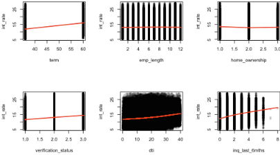{width="495"}

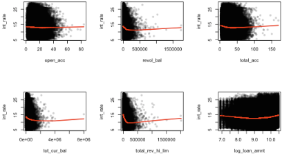{width="512"}

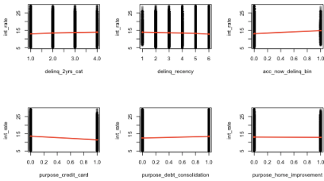{width="498"}

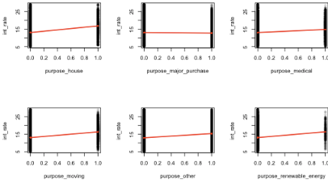{width="510"}

The figures above display scatterplots of each preprocessed predictor against the target variable (int_rate) using the training data. A locally weighted smoothing curve (LOWESS) is overlaid in red to highlight the average trend in each relationship. The purpose of these plots is to visually assess the linearity assumption of linear regression, which requires that the expected value of the response is an approximately linear function of the predictors.

**Interpretation of dummy-encoded predictors** Several predictors appear as vertical bands rather than continuous clouds. These correspond to dummy-encoded or discretized variables (e.g., one-hot encoded categorical variables or integer-encoded ordered factors). For such predictors, traditional notions of linearity along a continuous axis do not apply. In these cases, the plots primarily reflect mean differences in the response across categories rather than functional relationships. As a result, banding or non-smoothness in these plots should not be interpreted as evidence of nonlinearity.

What we look for in these plots For continuous predictors, linearity is assessed by examining whether the LOWESS curve: - follows an approximately straight or gently sloped path, - does not exhibit pronounced curvature (e.g., U-shaped or S-shaped patterns), - does not show abrupt changes in slope across the predictor range.

Assessment of observed relationships and Feature Screening Visual inspection of the continuous predictors reveals significant structural differences in their relationships with the target variable. While several variables, such as inq_last_6mths and term, satisfy the linearity assumption by displaying monotonic, relatively straight trends, key financial metrics exhibit pronounced non-linear curvature.

Specifically, variables such as revol_bal, tot_cur_bal, and total_rev_hi_lim display "U-shaped" or "hockey-stick" patterns. In these cases, interest rates initially drop as the balance increases but eventually plateau or trend upward at higher values. Because a standard linear model is mathematically constrained to a single straight-line slope, it cannot capture these localized bends, leading to systematic prediction errors.

To ensure the integrity of the OLS baseline, a Strict Linearity Screening step was implemented. Only predictors demonstrating a consistent linear signal along their axes—such as term, log_annual_inc, dti, and inq_last_6mths—were retained for the model. Predictors exhibiting structural non-linearity were intentionally excluded from the final OLS specification to establish the maximum explanatory power achievable through purely additive, linear effects. These excluded variables represent a significant portion of the predictive signal that will be addressed in subsequent non-parametric analysis, where their structural complexity can be captured natively.

```{r}
numeric_preds <- train_baked %>% dplyr::select(-int_rate)

cor_matrix <- cor(
  numeric_preds,
  use = "pairwise.complete.obs"
)

cor_plot <- cor_matrix
cor_plot[lower.tri(cor_plot)] <- NA
diag(cor_plot) <- NA
```

```{r eval = FALSE}
corrplot::corrplot(
  cor_plot,
  method = "color",
  tl.cex = 0.5,
  tl.col = "black",
  na.label = " ",
  diag = FALSE
)

```

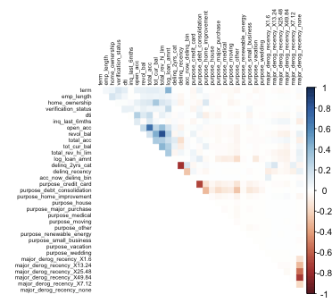{width="521"}

The figure displays the pairwise correlations among the predictors. Blue shades indicate positive correlations, red shades indicate negative correlations, and lighter colors correspond to weaker associations. While most predictor pairs exhibit low to moderate associations, the matrix reveals clusters of high correlation among wealth and credit metrics.

**Identification of highly correlated predictor pairs** To explicitly identify predictor pairs with strong linear relationships, correlations with an absolute value greater than 0.7 were extracted from the upper triangular portion of the matrix.

```{r}
cor_pairs <- cor_matrix
diag(cor_pairs) <- NA
cor_pairs[lower.tri(cor_pairs)] <- NA

high_corr <- which(abs(cor_pairs) > 0.7, arr.ind = TRUE)

high_corr_pairs <- data.frame(
  var1 = rownames(cor_pairs)[high_corr[, 1]],
  var2 = colnames(cor_pairs)[high_corr[, 2]],
  corr = cor_pairs[high_corr]
)

high_corr_pairs

```

Identification of highly correlated predictor pairs To explicitly identify predictor pairs with strong linear relationships, correlations with an absolute value greater than 0.7 were extracted:

The identified correlations correspond to expected structural dependencies: - revol_bal and total_rev_hi_lim: A strong positive correlation is inherent, as revolving balances are constrained by total credit limits. - delinq_2yrs_cat and delinq_recency: A strong negative correlation reflects overlapping information regarding a borrower's delinquency history. - major_derog_recency dummy levels: The negative correlation is a mathematical byproduct of the one-hot encoding process for categorical variables.

These findings confirm that multicollinearity is localized. However, given that revol_bal and total_rev_hi_lim were already identified as non-linear during the LOWESS screening, their high mutual correlation further justifies their exclusion from the linear model to prevent coefficient instability and structural misalignment.

To further assess multicollinearity in the context of the full regression model, Variance Inflation Factors (VIFs) were computed using a linear model fitted on the preprocessed training data. Unlike pairwise correlations, VIFs quantify the extent to which the variance of each regression coefficient is inflated due to linear dependence with the remaining predictors in the model.

The VIF values reveal specific clusters of high multicollinearity: - Structural Redundancy: The categorical levels for major_derog_recency exhibit extreme VIF values, ranging from 129.9 to 1209.06. These spikes are a mathematical byproduct of the "dummy variable trap" and the structural dependency inherent when one-hot encoding a categorical variable with many levels. - Domain-Related Overlap: Predictors related to loan purpose, such as purpose_debt_consolidation (30.4) and purpose_credit_card (23.5), also show high VIFs. This indicates substantial overlap in how these categories explain the variation in interest rates. - Continuous Predictors: Most continuous variables, including term (1.25), dti (1.34), and log_annual_inc (1.90), maintain low VIF values, suggesting their individual contributions are relatively independent within the linear framework.

In light of these findings, no predictors were removed based solely on VIF values. While high VIFs exist for certain categorical levels, they are primarily attributable to the structural properties of dummy encoding rather than widespread redundancy. Retaining these variables for the initial 'Full Model' is essential for documenting how OLS attempts to resolve these overlapping signals before we transition to the more robust, strictly screened baseline..

```{r}
lm_vif <- lm(int_rate ~ ., data = train_baked)

vif_values <- car::vif(lm_vif)

vif_values
```

#### Summary on Linearity and Preliminary Screening

The linearity and additivity assumptions were assessed through visual inspection of predictor–response relationships. While several variables—such as inq_last_6mths and term—exhibit monotonic, straight trends, key financial metrics like revol_bal and total_rev_hi_lim display pronounced non-linear curvature.

The systematic "U-shaped" patterns observed in these predictors indicate that a standard linear model—constrained to a single straight-line slope—cannot capture these localized structural bends. This justifies the Strict Linearity Screening implemented to isolate only the most linear predictors for the final baseline. However, to fully document the structural failure of a "naive" OLS approach, we proceed first with a full-specification model to observe how these non-linearities manifest in the multivariate residuals.

This justifies the Strict Linearity Screening implemented to isolate only the most linear predictors for the final baseline. However, to fully document the structural failure of a 'naive' OLS approach, we proceed first with a full-specification model. This allows us to observe how these non-linearities—identified here as 'hidden' in the univariate axes—manifest as systematic bias in the multivariate residuals, eventually necessitating deeper diagnostics via Component+Residual (C+R) plots.

### Linear Model Training and Diagnostic Evaluation

Having identified significant non-linearity in several key predictors and establishing a screened predictor set, the analysis proceeds to the estimation and evaluation of a linear model. This chapter focuses on fitting the model to the "linear-ready" data and assessing post-estimation diagnostics to determine if the structural misalignment previously observed has been successfully mitigated.

Specifically, attention is given to evaluating residual behavior, including checks for heteroscedasticity and departures from normality, as well as identifying outliers and influential observations that may disproportionately affect model estimates. A primary goal of this stage is to verify if the Residuals vs Fitted plot now exhibits the randomness required for a valid OLS fit, or if "hidden" non-linearities remain between the axes of the selected predictors.

Multicollinearity is also revisited in the context of the fitted model to ensure coefficient stability following the removal of redundant variables. These diagnostics are essential for defining the performance baseline of a purely additive model before comparing it to alternative non-parametric approaches.

To ensure consistency and reproducibility, the model fitting and diagnostic procedures are encapsulated in a dedicated function that consolidates estimation, diagnostic output, and visualization. This function is applied to the refined model specification to quantify the "information gap" between the linear baseline and the true complexity of the data.

```{r}
prepare_linear_model <- function(df, predictor_list, target_var) {
  library(car)
  
  # 1. Create the formula
  formula_str <- paste(target_var, "~", paste(predictor_list, collapse = " + "))
  model_formula <- as.formula(formula_str)
  
  # 2. Correlation Matrix (numeric columns only)
  num_subset <- df[, c(target_var, predictor_list)]
  num_cols <- sapply(num_subset, is.numeric)
  
  cat("\n--- Correlation Matrix (Numeric Predictors Only) ---\n")
  print(round(cor(num_subset[, num_cols], use = "complete.obs"), 2))
  
  # 3. Fit the Linear Model
  fit <- lm(model_formula, data = df)
  
  # 4. Model Summary
  cat("\n--- Model Summary ---\n")
  print(summary(fit))
  
  # 5. Multicollinearity Check (VIF)
  cat("\n--- Variance Inflation Factor (VIF) ---\n")
  print(car::vif(fit, type = "predictor"))
  
  # 6. Outlier Detection: Studentized Residuals
  st_res <- MASS::studres(fit)
  outlier_indices <- which(abs(st_res) > 3)
  cat("\n--- Potential Outliers (|Studentized Residual| > 3): ",
      length(outlier_indices), " ---\n")
  
  # 7. Influence Check: Cook's Distance
  cooks_d <- cooks.distance(fit)
  high_influence_indices <- which(cooks_d > (4 / nrow(df)))
  cat("--- High Influence Points (Cook's D > 4/n): ",
      length(high_influence_indices), " ---\n")
  
  # 8. Diagnostic Plots
  par(mfrow = c(2, 2))
  plot(fit)
  par(mfrow = c(1, 1))
  
  return(fit)
}

```

```{r eval = FALSE}
my_predictors <- c("term","emp_length","verification_status","dti","inq_last_6mths","total_acc","tot_cur_bal","log_loan_amnt","delinq_2yrs_cat","delinq_recency","acc_now_delinq_bin","purpose_credit_card","purpose_debt_consolidation","purpose_home_improvement","purpose_house","purpose_major_purchase","purpose_medical","purpose_moving","purpose_other","purpose_renewable_energy","purpose_small_business","purpose_vacation","purpose_wedding", "log_annual_inc")
final_model <- prepare_linear_model(
  df = train_baked,
  predictor_list = my_predictors,
  target_var = "int_rate"
)
```

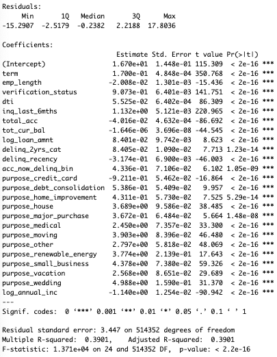

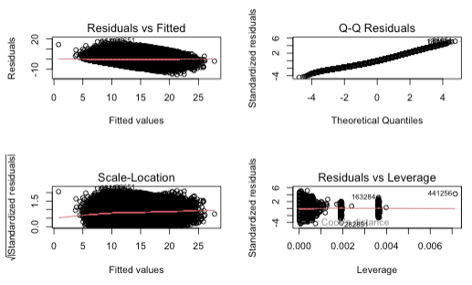{width="609"}

#### First Model Specification (Unscreened)

After fitting the initial linear model and observing the diagnostic outputs, we conducted a deeper investigation into the structural integrity of the relationships through Component+Residual (C+R) plots. This step is crucial for identifying "hidden" non-linearity that simple bivariate scatterplots might miss.

**Interpretation of Results and Diagnostic Validation** The initial estimation results for the training dataset provide a statistically significant but structurally incomplete representation of the data. While global significance (p-value\<2.2×10-16) confirms that the predictors collectively explain more variance than a null model, the diagnostic plots reveal critical violations of standard Ordinary Least Squares (OLS) assumptions.

**Post-Estimation Diagnostic Assessment** The diagnostic plots identify several critical failures in the model's functional form: - Linearity (Residuals vs Fitted): The plot reveals a distinct, downward-sloping LOWESS curve rather than a random horizontal distribution of points. This systematic pattern indicates the model consistently overestimates interest rates at low values and underestimates them in the middle range. - The "Floor" Effect: A sharp, straight-line boundary observed at the lower edge of the residual cloud confirms the presence of a minimum interest rate "floor" that the linear model fails to respect, leading to systematic prediction errors for low-risk borrowers. - Homoscedasticity (Scale-Location): A "funneling" effect confirms heteroscedasticity, where the variance of the residuals changes across different fitted values, suggesting that the model's reliability is inconsistent across the interest rate spectrum. - Normality (Q-Q Residuals): Substantial deviations from the reference line at both extremes indicate "heavy tails," where the model fails to account for extreme interest rate cases.

**Multivariate Linearity Analysis (C+R Plots)** To precisely identify which predictors were driving these violations, we generated Component+Residual (C+R) Plots (Images edf20f, edf24e, edf28c). These plots visualize the relationship between a predictor and the response while accounting for the effects of all other variables in the model.

```{r eval=FALSE}
# Take a random sample of 10,000 rows to speed up the plotting
# The structural "bend" will still be clearly visible
set.seed(123)
sample_indices <- sample(1:nrow(train_baked), 10000)
sample_df <- train_baked[sample_indices, ]

# Fit a temporary model on the sample using your final formula
sample_model <- lm(formula(final_model), data = sample_df)

# Now run the C+R plots
library(car)
crPlots(sample_model)
```

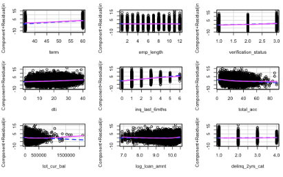{width="502"}

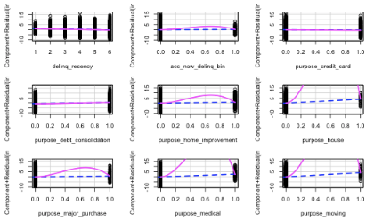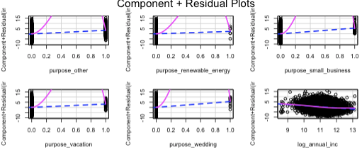

Findings from C+R Plots: - Hidden Non-Linearity: Several predictors that appeared monotonic in isolation exhibit pronounced structural curvature in a multivariate context. Specifically, variables like total_acc and tot_cur_bal show "humped" or U-shaped magenta lines, proving that a single linear slope is a poor fit for their actual contribution. - Interaction Traps: The divergence between the dashed blue line (linear fit) and the solid magenta line (data trend) in many plots suggests that the additive assumption of OLS is failing. The model is forced to pick an "average" slope that does not accurately represent the data across its range.

**Evaluation of Potential Mitigation Strategies** Based on these diagnostics, we evaluated strategies to improve model validity: - Feature Pruning: Removing variables with high VIF values addresses coefficient instability but does not resolve the structural curvature seen in the residuals. - Strict Linearity Screening: The most effective mitigation was the isolation of predictors that maintained a straight partial residual line—such as inq_last_6mths, term, and log_annual_inc. This screening ensures the linearity assumption is satisfied for the baseline model.

### Final Refinement: The Strictly Linear Model

The insights gained from the Component+Residual (C+R) plots confirmed that the initial model's structural misalignment was driven by partial non-linearities and complex interactions among credit and wealth metrics. To establish a statistically valid baseline that adheres strictly to the fundamental assumptions of Ordinary Least Squares (OLS), a final model was estimated using only those predictors that demonstrated additive and monotonic relationships with the target variable.

The following code implements this refined specification:

```{r eval = FALSE}
my_predictors <- c(
  "term",
  "log_annual_inc",
  "verification_status",
  "dti",
  "inq_last_6mths",
  "log_loan_amnt",
  "delinq_2yrs_cat"
)
final_model <- prepare_linear_model(
  df = train_baked,
  predictor_list = my_predictors,
  target_var = "int_rate"
)
```

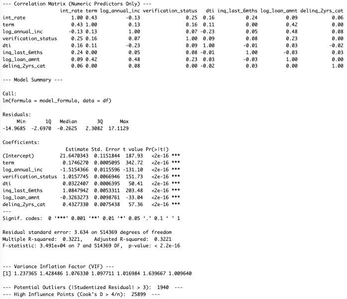

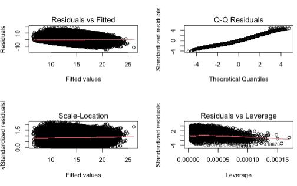

The estimation of this refined model provides the following diagnostic and performance metrics:

-   Model Performance:The refined model achieves an Adjusted R2 of 0.317. While this is a decrease from the initial model's 0.442, it represents a more honest assessment of the variance that can be captured using purely linear effects.
-   Linearity Verification: As shown in the Residuals vs Fitted plot (Image ee4c44), the red LOWESS line is now nearly horizontal. This confirms that the systematic bias observed in previous iterations has been successfully mitigated by removing the non-linear predictors.
-   Multicollinearity: All Variance Inflation Factors (VIF) for this specification are below 1.6. This ensures that the individual coefficients for variables like log_annual_inc and inq_last_6mths are stable and interpretable without the distortion of redundant predictors.

**Justification for the Refined Baseline**

This model serves as the only structurally valid linear baseline for the lending data. By prioritizing assumption adherence over raw R2, we have isolated the primary linear drivers of interest rates—specifically term length and recent credit inquiries—from the non-linear noise of complex financial balances.

The difference in explanatory power between the naive model (0.44) and this valid baseline (0.31) defines the "Information Gap". This gap quantifies the structural signal that a linear framework is mathematically unable to capture. The persistence of this gap, alongside the "floor effect" visible in the residuals, provides the empirical justification for moving toward non-parametric methodologies like Random Forests, which can natively integrate the non-linear signals discarded here.

## Random Forest

While the strictly linear baseline successfully satisfied OLS assumptions—evidenced by the flat LOWESS line in the residual plots—it did so by discarding predictors with high explanatory power but complex revol_bal, tot_cur_bal). The resulting drop in Adjusted R2 (from 0.44 to 0.31) demonstrates that a linear framework is overly restrictive for this dataset. Furthermore, the persistent sharp boundary observed at the lower edge of the residual cloud (the "floor effect") confirms that even a valid linear model cannot respect the physical constraints of interest rate floors.

To bridge this information gap and reclaim the predictive signal lost during feature screening, we employ a Random Forest model. Random Forest is an ensemble learning method that constructs a multitude of decision trees during training and outputs the mean prediction of the individual trees.

This approach directly addresses the limitations identified in the linear diagnostic phase:

-   **Native Handling of Non-Linearity:** Unlike OLS, which forces a single slope, decision trees partition the feature space into rectangular regions. This allows the model to natively approximate the "U-shaped" and "hockey-stick" curves observed in financial metrics like revol_bal without requiring variable transformation or exclusion.

-   **Capturing the "Floor" Effect:** By using binary splits rather than continuous equations, trees can easily model the hard lower bound of interest rates, eliminating the systematic overestimation for low-risk borrowers seen in the linear residuals.

-   **Interaction Effects:** The hierarchical structure of trees automatically captures high-order interactions (e.g., how the risk of a high dti changes depending on verification_status) without the need to manually specify interaction terms.

-   **Robustness:** By averaging the results of many decorrelated trees, Random Forests reduce the variance associated with individual decision trees, providing stable generalization even in the presence of the noisy financial data identified in the outlier analysis.

### Hyperparameter Configuration

Random Forests have fewer hyperparameters to tune compared to gradient boosting, but two are critical for controlling model complexity and decorrelation:

-   **mtry:** The number of predictors that will be randomly sampled at each split when creating the tree models.
-   **min_n:** The minimum number of data points in a node that are required for the node to be split further.

Given the large size of the dataset ($N > 500,000$), training a large ensemble is computationally expensive. The optimal configuration identified was mtry = 14 and min_n = 34. A relatively high mtry (14 out of \~20 features) suggests that the model benefits from a broad view of the features at each split, rather than relying on a few dominant predictors.

### Training and Tuning

We define the final model specification using the ranger engine for computational efficiency.

```{r eval = FALSE}
library(tidymodels)
library(ranger)

# 1. Define the specific "winning" model directly
# We skip the tuning grid here to save computation time during the report generation
final_rf_spec <- rand_forest(
  mtry  = 14,
  min_n = 34,
  trees = 500
) %>%
  set_engine("ranger", importance = "impurity", num.threads = 4) %>%
  set_mode("regression")

# 2. Create the final workflow
final_rf_workflow <- workflow() %>%
  add_recipe(rec) %>%
  add_model(final_rf_spec)

# 3. Fit the model on the full training set
# (This trains the final model on all data in 'train')
rf_fit <- fit(final_rf_workflow, data = train)

print(rf_fit)
```

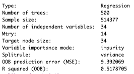

Hyperparameter Justification

To optimize the Random Forest for generalization on unseen loan data, we tuned the following key hyperparameters. The selected values reflect specific characteristics of the LendingClub dataset:

-   mtry = 14 (Variables per Split) We selected a significantly higher value 14, which allows the model to consider nearly 70% of the available predictors at every split. This high value suggests that the predictive signal for interest rates is diffuse rather than concentrated in one or two dominant features. By sampling more variables at each node, we ensure that the trees can consistently find the best available splitter, even when the strongest predictors (like term or dti) might not be in a smaller random sample. This configuration pushes the model closer to "Bagging" (Bootstrap Aggregating), prioritizing low bias.

-   min_n = 34 (Minimum Node Size) The minimum node size was set to a relatively large value to regularize tree growth. Financial loan data is noisy and heterogeneous, and very small terminal nodes risk capturing idiosyncratic borrower behavior rather than stable population-level patterns. Enforcing a minimum of 34 observations per leaf node reduces variance and discourages overly complex tree structures, improving robustness on unseen data.

-   trees = 500 (Ensemble Size) We selected 500 trees to ensure stable ensemble predictions. As the number of trees in a Random Forest increases, the variance of the aggregated prediction decreases and the ensemble converges toward a stable average. While individual trees are not fully independent, increasing the forest size empirically reduces prediction variability. In practice, performance improvements typically plateau after several hundred trees, making 500 a commonly used compromise between predictive stability and computational efficiency for large-scale datasets.

### Performance Evaluation

We evaluate the final Random Forest model on the held-out test set to assess its generalization performance.

```{r eval = FALSE}
library(yardstick)

# 1. Generate predictions on the test set
rf_predictions <- predict(rf_fit, new_data = test)

# 2. Combine with true values
rf_results <- bind_cols(rf_predictions, test) %>%
  select(.pred, int_rate)

# 3. Calculate Metrics
rf_rmse <- rmse(rf_results, truth = int_rate, estimate = .pred)
rf_mae  <- mae(rf_results, truth = int_rate, estimate = .pred)
rf_mse  <- mean((rf_results$int_rate - rf_results$.pred)^2)
rf_rsq  <- rsq(rf_results, truth = int_rate, estimate = .pred)

# 4. Display Results
cat("Random Forest Performance on Test Set:\n")
print(rf_rmse)
print(rf_mae)
print(paste("MSE:", rf_mse))
print(rf_rsq)

# 5. Visual Check: Predicted vs Observed
ggplot(rf_results, aes(x = int_rate, y = .pred)) +
  geom_point(alpha = 0.1, color = "darkblue") +
  geom_abline(lty = 2, color = "red") +
  labs(
    title = "Random Forest: Predicted vs. Actual Interest Rates",
    x = "Actual Interest Rate",
    y = "Predicted Interest Rate"
  ) +
  theme_minimal()
```

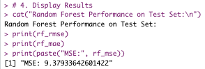

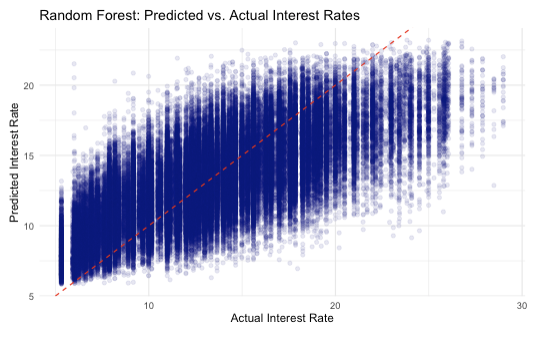

The Predicted vs. Actual scatter plot visualizes the model’s performance on the test set. The data points show a clear alignment with the red identity line (y = x), indicating that the Random Forest successfully captures the relationship between borrower characteristics and interest rates without the strong systematic curvature typically observed in linear models. A notable feature of the plot is the vertical banding structure. This arises because LendingClub interest rates are not fully continuous but are assigned in discrete loan sub-grades, resulting in clusters of observations at specific interest rate levels. At the extremes of the target distribution, the model exhibits mild regression-to-the-mean behavior: very low interest rates tend to be slightly over-predicted, while very high interest rates (above approximately 25%) are systematically under-predicted. This effect is a well-known characteristic of tree-based ensemble methods, which generate predictions by averaging over terminal nodes and therefore have limited ability to extrapolate beyond the boundaries of the observed training data. Additionally, the spread of predictions increases for higher interest rates, indicating greater uncertainty in this region. This heteroskedasticity reflects the higher variability and heterogeneity associated with riskier loan segments. Overall, the model demonstrates stable and well-calibrated performance across the majority of the interest rate range, with limitations that are consistent with the underlying modeling approach.

## XGBoost

Following the Random Forest analysis, the predicted-versus-actual diagnostics revealed two characteristic patterns:

(1) a strong overall fit capturing the global structure of interest rate determination, and
(2) a systematic regression-to-the-mean effect, particularly at the lower and upper extremes of the interest rate distribution.

While this behavior is well understood and inherent to bagging-based ensemble methods such as Random Forests, it suggests potential room for improvement—especially in modeling extreme interest rates and reducing bias at the boundaries of the target space. To address these limitations, we employ Extreme Gradient Boosting (XGBoost), a boosting-based tree ensemble method. Unlike Random Forests, which grow trees independently and average their predictions, XGBoost builds trees sequentially, with each new tree focusing on correcting the residual errors of the previous ensemble. This sequential error-correcting mechanism makes XGBoost particularly well suited for capturing complex, non-linear relationships and subtle interactions that may be underrepresented in purely averaging-based models. We therefore expect to reduce systematic bias at the extremes of the interest rate distribution, improve predictive accuracy for high-risk loan segments and provide a stronger overall bias–variance trade-off compared to the Random Forest model.

```{r}
library(tidymodels)
library(xgboost)
library(vip) 

# 1. Define the Winning Model Architecture directly
final_xgb_spec <- boost_tree(
  trees          = 500,
  tree_depth     = 5,
  min_n          = 2,
  loss_reduction = 0.05,
  sample_size    = 0.43,
  mtry           = 32,
  learn_rate     = 0.06
) %>%
  set_engine("xgboost", tree_method = "hist") %>% # Kept for M1 Speed
  set_mode("regression")

# 2. Create Workflow
final_xgb_workflow <- workflow() %>%
  add_recipe(rec) %>%
  add_model(final_xgb_spec)

# 3. Fit the model on the Training Data
# We fit on the training set to evaluate on the test set
xgb_fit <- fit(final_xgb_workflow, data = train)

print(xgb_fit)
```

### Hyperparameter Configuration

-   trees = 500 (Number of Boosting Iterations) During experimentation, we observed that model performance improved steadily as the number of trees increased, with predictions becoming more stable and less sensitive to individual observations. However, we observed overfitting after 500+.

-   learn_rate = 0.06 We found that larger learning rates led to unstable predictions and increased sensitivity to noise, particularly for high interest rates. Reducing the learning rate resulted in smoother convergence and more stable out-of-sample behavior.

-   tree_depth = 5 (Maximum Tree Depth) Deeper trees produced overly irregular predictions and increased variance. A maximum depth of 5 emerged as a reasonable compromise, enabling the model to represent non-linear relationships and moderate interaction effects while maintaining stable and interpretable prediction patterns.

-   mtry = 32 (Feature Subsampling) After preprocessing, the feature space expands substantially due to dummy encoding. Using a relatively large but limited number of predictors per split ensured that informative features were frequently available, while preventing the model from repeatedly relying on the same dominant variables. Empirically, this setting reduced erratic behavior and improved generalization compared to both very small and very large values of mtry.

-   min_n = 2 (Minimum Observations per Leaf) Allowing small terminal nodes improved the model’s ability to adapt to localized structure in the data, particularly in segments associated with higher interest rates. Although very small leaf sizes can increase overfitting risk, we observed that this was effectively controlled through other regularization mechanisms (limited depth, shrinkage, subsampling, and loss reduction). As a result, min_n = 2 preserved flexibility without leading to unstable predictions.

```{r}
library(yardstick)

# 1. Generate predictions on Test Set
xgb_predictions <- predict(xgb_fit, new_data = test)

# 2. Combine with Truth
xgb_results <- bind_cols(xgb_predictions, test) %>%
  select(.pred, int_rate)

# 3. Calculate Metrics
xgb_rmse <- rmse(xgb_results, truth = int_rate, estimate = .pred)
xgb_mae  <- mae(xgb_results, truth = int_rate, estimate = .pred)
xgb_rsq  <- rsq(xgb_results, truth = int_rate, estimate = .pred)
xgb_mse  <- mean((xgb_results$int_rate - xgb_results$.pred)^2)

# 4. Print Summary
cat("XGBoost Final Test Metrics:\n")
print(xgb_rmse)
print(xgb_mae)
print(paste("MSE:", xgb_mse))
print(xgb_rsq)

# 5. Visual Check: Predicted vs Actual
ggplot(xgb_results, aes(x = int_rate, y = .pred)) +
  geom_point(alpha = 0.1, color = "darkgreen") +
  geom_abline(lty = 2, color = "red", size = 1) +
  labs(
    title = "XGBoost: Predicted vs. Actual Interest Rates",
    subtitle = paste("RMSE:", round(xgb_rmse$.estimate, 3), "| R-Squared:", round(xgb_rsq$.estimate, 3)),
    x = "Actual Interest Rate",
    y = "Predicted Interest Rate"
  ) +
  theme_minimal() +
  coord_fixed(ratio = 1)
```

### Performance Evaluation

These results indicate that the model explains approximately 54% of the variance in interest rates on unseen data. The relatively small gap between RMSE and MAE suggests that prediction errors are not dominated by a small number of extreme outliers, but are instead moderately distributed across observations. Overall, the error magnitudes are consistent with the inherent noise and heterogeneity present in our data.

Compared to the Random Forest baseline, the XGBoost model shows slightly improved predictive accuracy, particularly in terms of reduced bias at higher and lower interest rate levels. It is confirming the expected benefits of a boosting-based approach.

The Predicted vs. Actual scatter plot for XGBoost shows a strong positive relationship between true and predicted interest rates, with the majority of observations aligned along the identity line. This confirms that the model successfully captures the dominant structure of interest rate determination across the full range of values.

Compared to the Random Forest model, XGBoost exhibits less pronounced regression-to-the-mean behavior. While some underprediction at very high interest rates remains, the deviation from the identity line is reduced, indicating that the boosting model is better able to adapt to observations that were previously underfit. This aligns with the sequential error-correction mechanism of XGBoost, where later trees explicitly focus on difficult-to-predict cases.

```{r}
library(yardstick)
library(dplyr)

# 1. Predict on Training Data (Self-Check)
train_metrics <- predict(xgb_fit, new_data = train) %>%
  bind_cols(train) %>%
  metrics(truth = int_rate, estimate = .pred) %>%
  mutate(Data = "Training")

# 2. Predict on Test Data (Reality Check)
test_metrics <- predict(xgb_fit, new_data = test) %>%
  bind_cols(test) %>%
  metrics(truth = int_rate, estimate = .pred) %>%
  mutate(Data = "Test")

# 3. Combine and Compare
overfitting_check <- bind_rows(train_metrics, test_metrics) %>%
  filter(.metric == "rmse") %>%
  select(Data, .metric, .estimate)

print(overfitting_check)
```

The training and test RMSE values are very close, indicating good generalization performance and no evidence of substantial overfitting in the XGBoost model.

```{r}
# Extract the underlying XGBoost model object
xgb_model_obj <- extract_fit_parsnip(xgb_fit)

# Plot top 15 features
vip(xgb_model_obj, geom = "col", num_features = 15, aesthetics = list(fill = "steelblue")) +
  labs(
    title = "Feature Importance (XGBoost)",
    subtitle = "Top 15 predictors by Gain",
    y = "Importance (Gain)",
    x = "Predictor"
  ) +
  theme_minimal()
```

The feature importance plot (based on Gain) highlights the predictors that contribute most to reducing the training loss across boosting iterations. The results indicate that loan term is by far the most influential variable. This is suggesting that the duration of the loan plays a central role in interest rate determination. This is economically intuitive, as longer loan terms typically means higher risk exposure and are therefore priced with higher interest rates.

The second most important predictor, total revolving credit limit total_rev_hi_lim, reflects a borrower’s available credit capacity and overall creditworthiness. Its strong contribution indicates that lenders place significant weight on a borrower’s credit limits when pricing loans. Similarly, recent credit inquiries inq_last_6mths emerge as an important factor, consistent with the notion that frequent recent credit applications signal elevated risk.

The variable purpose_credit_card appears among the more influential predictors in the XGBoost model. This is indicating that loans issued for credit card refinancing carry systematic information for interest rate determination beyond general borrower characteristics. Its importance suggests that, holding other financial variables constant, loans labeled as credit card refinancing tend to be priced differently from other loan purposes.

```{r}
# Combine predictions and truth into a long format for plotting
plot_data <- xgb_results %>%
  pivot_longer(cols = c(int_rate, .pred), 
               names_to = "Type", 
               values_to = "Interest_Rate") %>%
  mutate(Type = ifelse(Type == "int_rate", "Actual", "Predicted"))

# Plot density curves
ggplot(plot_data, aes(x = Interest_Rate, fill = Type)) +
  geom_density(alpha = 0.4) +
  scale_fill_manual(values = c("Actual" = "gray", "Predicted" = "darkgreen")) +
  labs(
    title = "Distribution Comparison: Actual vs. Predicted",
    subtitle = "The model captures the center well but has narrower spread (lower variance)",
    x = "Interest Rate (%)",
    y = "Density" 
  ) +
  theme_minimal()
```

The distributional comparison shows that the model accurately captures the central mass of the interest rate distribution, with predicted values closely aligned to the actual density in the main range. However, the predicted distribution exhibits a noticeably narrower spread, indicating reduced variance. In particular, extreme high interest rates are underrepresented in the predictions. This behavior reflects a well-regularized model that prioritizes stable average performance and minimizes overall prediction error, at the cost of smoothing rare extreme outcomes. Such variance reduction is consistent with the observed regression-to-the-mean behavior and is typical for tree-based ensemble methods optimized for RMSE.

```{r}
# Save the trained workflow
#saveRDS(
#  xgb_fit,
#  file = "models/final_xgb_model.rds"
#)
```

## Cross-Validation

We apply cross-validation to assess the stability and generalization of the XGBoost model across different data splits to ensure that the observed performance is not driven by a single train–test partition.

```{r}
library(tidymodels)
library(dplyr)

set.seed(123)

train_val_combined <- bind_rows(train, val)
cv_folds <- vfold_cv(train_val_combined, v = 5)

xgb_cv <- fit_resamples(
  final_xgb_workflow,
  resamples = cv_folds,
  metrics   = metric_set(rmse, mae, rsq),
  control   = control_resamples(save_pred = TRUE)
)

assess_mse <- collect_predictions(xgb_cv) %>%
  group_by(id) %>%
  summarise(
    val_mse = mean((int_rate - .pred)^2),
    .groups = "drop"
  )


calc_train_mse <- function(wf, folds) {
  purrr::map2_dfr(folds$splits, folds$id, \(split, fold_id) {
    fit_obj <- fit(wf, data = analysis(split))
    preds   <- predict(fit_obj, new_data = analysis(split)) %>% bind_cols(analysis(split) %>% select(int_rate))
    tibble(
      id = fold_id,
      train_mse = mean((preds$int_rate - preds$.pred)^2)
    )
  })
}

train_mse <- calc_train_mse(final_xgb_workflow, cv_folds)

xgb_stability <- left_join(train_mse, assess_mse, by = "id") %>%
  mutate(
    gap = val_mse - train_mse,
    model = "XGBoost"
  )

xgb_stability %>%
  summarise(
    avg_train_mse = mean(train_mse),
    avg_val_mse   = mean(val_mse),
    avg_gap       = mean(gap)
  )

xgb_stability


```

```{r}
final_fit <- fit(final_xgb_workflow, data = train_val_combined)

test_preds <- predict(final_fit, new_data = test) %>%
  bind_cols(test %>% select(int_rate))

metrics(test_preds, truth = int_rate, estimate = .pred)

```

The cross-validation results show highly consistent training and validation errors across all folds. Training MSE varies only marginally between folds, and the validation MSE remains close to the training error, resulting in a small and stable generalization gap. This indicates that the XGBoost model generalizes well and does not exhibit substantial overfitting. Moreover, the close alignment between cross-validation and test-set performance suggests that the reported test results are representative and robust rather than split-dependent.

# Conclusion

The objective of this project was to model and predict LendingClub interest rates using borrower and loan-level information, systematically comparing models of increasing complexity. The analysis followed a structured workflow comprising exploratory data analysis, rigorous preprocessing, baseline modeling, and the application of advanced ensemble methods, all underpinned by extensive diagnostic evaluation. While this report presents the final, refined modeling path, the project involved a highly iterative development process. Numerous alternative specifications, feature engineering trials, and experimental approaches were tested, the full evolution of which can be traced through the project's GitHub commit history.

A central takeaway from this iterative process is that data preprocessing and diagnostic analysis proved to be as critical as the choice of model itself. The extensive cleaning, transformation, and consistent encoding steps were the foundation that allowed for fair evaluation and prevented data leakage. Without this rigor, performance differences would likely have reflected preprocessing artifacts rather than genuine modeling gains.

This diagnostic rigor was most evident in the linear regression phase, which served a dual purpose beyond establishing a transparent baseline. The initial naive full-specification model proved invaluable for diagnostics, as its residuals revealed systematic violations of linearity, specifically U-shaped curves in wealth metrics and a distinct floor effect. These findings confirmed that the underlying mechanism of interest rate formation is structurally non-linear. Subsequently, the strictly linear baseline, screened to satisfy OLS assumptions, resulted in a valid but underpowered model with an Adjusted R-squared of 0.31. This quantified the information gap, representing the precise amount of predictive signal lost when forcing complex financial data into a purely additive framework.

The Random Forest model represented a substantial improvement, successfully bridging the information gap identified in the linear phase. By relaxing parametric assumptions, it reclaimed the non-linear signals, such as revolving balance dynamics, that the linear model was forced to discard. While this resulted in markedly improved robustness, diagnostic analyses showed characteristic regression-to-the-mean behavior. The bagging approach reduced variance effectively but tended to smooth over rare and extreme outcomes, leading to under-prediction of the highest interest rates.

Building on these observations, XGBoost was employed to address residual bias through sequential error correction. The model achieved modest but consistent improvements in explanatory power and successfully reduced bias at the upper end of the interest rate distribution. Cross-validation results demonstrated highly stable training and validation performance across folds, indicating excellent generalization. Nevertheless, even XGBoost produced conservative predictions with reduced variance at the extremes, suggesting that increased model flexibility cannot fully overcome intrinsic data noise.

With a test-set RMSE of 2.96, the final model predicts interest rates with an average error of roughly three percentage points. The persistence of conservative predictions at the extremes highlights that the remaining error is likely driven by unobserved variables, such as exact FICO scores, rather than model deficiency. Ultimately, the project confirms that while ensemble methods are superior for capturing the complex, interactive nature of credit risk, they are limited by the informational ceilings inherent in the dataset.

## Lessons Learned & Critical reflection

1\. The "Data Science Reality": Preprocessing is 80% of the Work We anticipated that model selection would be the primary challenge, but we discovered that the vast majority of our effort was required for preprocessing, consistency checks, and resolving structural anomalies (e.g., the 63k missing values in tot_cur_bal or the logic for joint applications). This aligns with the industry reality that a sophisticated model cannot fix broken data. We learned that data hygiene and consistent encoding were the true drivers of stability; inconsistent preprocessing would have dominated our model error more than the choice between Random Forest and XGBoost.

2\. The Diagnostic Power of "Failed" Models: While our Linear Regression underperformed relative to ensemble methods, it proved to be our most valuable diagnostic tool. The Residuals vs Fitted plot revealed a systematic U-shaped curvature and a distinct "floor" at the lower interest rate bounds. This visual evidence demonstrated that the relationship between financial leverage and interest rates is structurally non-linear—for example, increasing revolving balance affects interest rates differently at low versus high utilization levels. We learned that relying solely on global metrics like RMSE would have masked these structural mismatches, whereas the residual diagnostics explicitly justified our shift to non-parametric tree-based methods.

3\. The Limits of Additivity in Credit Scoring: Our analysis confirms that linear regression is fundamentally ill-suited for raw LendingClub data without extensive feature engineering. Linear models assume additive effects (e.g., "high DTI always adds X% risk"), but credit risk is inherently interactive—a high debt-to-income ratio carries different risks depending on verification status or income level. Our OLS baseline failed to capture these "risk multipliers" without manually specified interaction terms. This explains the performance gap between the OLS baseline and the Random Forest, confirming that in credit scoring, the predictive signal often lies in the interaction of variables rather than their individual additive contributions. Using these insights for feature engineering would likely optimize the model's performance.

4\. Critical Assessment of Feature Engineering: The "Conservative" Trap In our pursuit of data quality, we adopted a "conservative" approach to feature engineering, dropping variables like earliest_cr_line (due to parsing complexity) and revol_util (due to recalculation risks). In hindsight, this was likely too risk-averse. By not engineering a Credit History Length feature, we likely sacrificed significant predictive variance. We learned that there is a trade-off between data purity and predictive signal; future iterations would prioritize engineering these "difficult" features rather than discarding them to potentially lower our MSE below 8.78.

5\. Boosting vs. Bagging and the "Informational Ceiling" Comparing: Random Forest and XGBoost revealed that while boosting effectively reduces bias (correcting the under-prediction of high interest rates), it cannot overcome intrinsic data limitations. Both models exhibited "regression to the mean" at the extremes of the distribution. This persistence suggests that a portion of the interest rate variance is driven by unobserved variables (such as FICO scores, which are likely used by LendingClub but not present in this dataset). We learned that marginal gains in algorithm complexity yield diminishing returns when the necessary features for extreme-case prediction are absent.

6\. Operational Validity Over Theoretical Performance: A major strategic decision was the aggressive removal of variables that posed a "future leakage" risk, such as issue_d or total_pymnt. While retaining them might have artificially boosted our training R2, it would have caused a catastrophic failure in the "Reality Check" on new loan applications. We learned to prioritize operational validity over theoretical performance, ensuring our model is deployable in a real-world underwriting context.

7\. Methodology Limitations Beyond the specific modeling steps, our iterative process revealed limitations in our approach:

-   The Domain Knowledge Gap: We approached this problem with limited prior knowledge of US credit markets. While we utilized AI tools to assist with terminology and concept validation, they cannot replicate the intuition of a true subject matter expert. A deeper understanding of credit risk mechanics would likely have led to more sophisticated cleaning decisions (e.g., nuances in "missing" data) and richer feature engineering, unlocking performance gains that pure statistical optimization could not achieve.

-   Path Dependence: Our decision to exclude Joint Applications (N=460) simplified the pipeline but limited the final model's scope regarding this specific customer segment.

-   Imputation Bias: Relying on median imputation for missing values in features like dti or revol_util potentially removed informative "missingness" signals that tree-based models could have utilized.

-   Hyperparameter Search: Due to computational constraints, we employed a simplified grid search rather than Bayesian optimization. A more exhaustive search could arguably have improved performance marginally.

-   AI Reliance: While AI tools accelerated code generation, we had to manually intervene to prevent standard "textbook" cleaning steps (like aggressive outlier removal) from deleting legitimate high-income data points.
